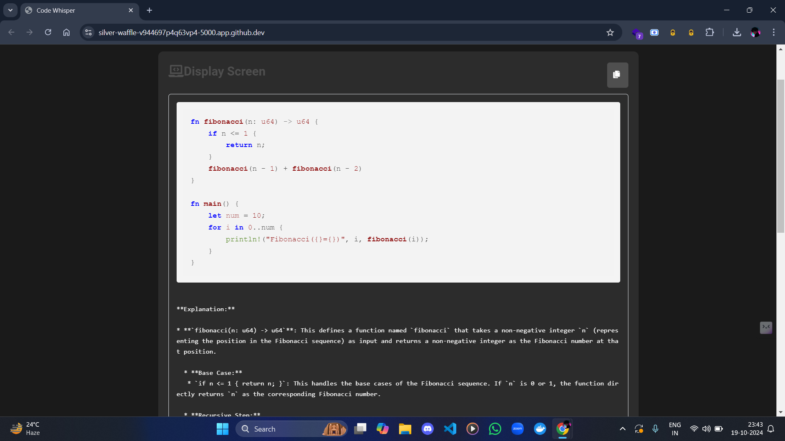
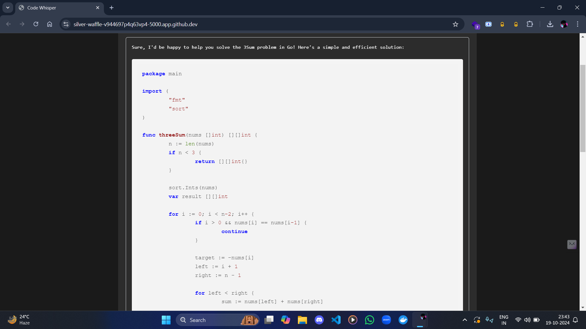
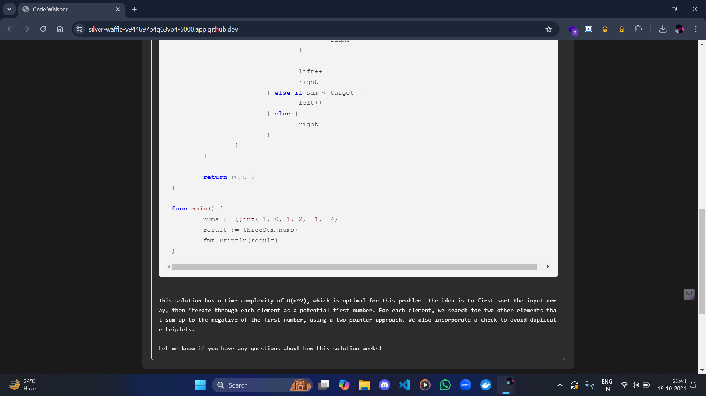

# CodeChatter: AI-Powered Coding Assistant

CodeChatter is an advanced Flask-based application that harnesses the power of the Groq API to provide intelligent coding assistance. This versatile tool offers multiple AI model selections, enabling developers to leverage artificial intelligence for various coding tasks, including code completion, debugging, and optimization.

## 🌟 Key Features

- **AI-Powered Coding Assistance**: Utilize state-of-the-art AI models to enhance your coding process.
- **Multi-Model Support**: Choose from a range of AI models to best suit your specific coding needs.
- **Syntax Highlighting**: Enjoy clear, color-coded syntax for multiple programming languages.
- **One-Click Code Copying**: Easily copy generated code snippets with a single click.
- **Responsive Design**: Access CodeChatter seamlessly across various devices and screen sizes.
- **User-Friendly Interface**: Intuitive design for effortless interaction with AI models.

## 🚀 Technology Stack

- **Backend**:  
- **Frontend**:   
- **AI Integration**: 

## 🛠️ Installation and Setup

1. **Clone the Repository**
   ```bash
   git clone https://github.com/yashksaini-coder/CodeChatter.git
   cd CodeChatter
   ```

2. **Set Up a Virtual Environment** (Recommended)
   ```bash
   python -m venv venv
   source venv/bin/activate  # On Windows, use `venv\Scripts\activate`
   ```

3. **Install Dependencies**
   ```bash
   pip install -r requirements.txt
   ```

4. **Configure Environment Variables**
   Create a `.env` file in the root directory with the following content:
   ```
   GROQ_API_KEY=your_api_key_here
   FLASK_ENV=development
   ```
   Replace `your_api_key_here` with your actual Groq API key.

5. **Run the Application**
   ```bash
   python app.py
   ```

6. **Access the Application**
   Open your web browser and navigate to `http://localhost:5000`

## 💻 Usage Guide

1. **Enter Your Query**: Type your coding question or describe the task in the provided textarea.
2. **Select AI Model**: Choose the most appropriate AI model for your task from the dropdown menu.
3. **Submit Query**: Click the "Ask" button to send your request to the AI.
4. **View Response**: The AI-generated code or explanation will appear in the display area.
5. **Copy Code**: Use the copy button next to code snippets for easy copying.

## 🧪 A preview

<div align="center" style="display: flex; flex-direction: column; align-items: center;">
   
   
      
</div>

--- 
## 🤝 Contributing

We welcome contributions to CodeChatter! Here's how you can help:

Here's the section with the corresponding Git commands added for clarity:

1. **Fork the repository**  
   - Click the [Fork](https://github.com/yashksaini-coder/CodeChatter) button in the top-right corner of the repository page on GitHub.

2. **Create a new branch**  
   ```bash
   git checkout -b feature/AmazingFeature
   ```

3. **Make your changes**  
   (Edit the necessary files in your local repository.)

4. **Commit your changes**  
   ```bash
   git commit -m 'Add some AmazingFeature'
   ```

5. **Push to the branch**  
   ```bash
   git push origin feature/AmazingFeature
   ```

6. **Open a Pull Request**  
   - Go to your GitHub repository, navigate to the "Pull Requests" tab, and click "New Pull Request." Select your branch and follow the prompts to submit your Pull Request.

This structured list should help guide users through the process effectively!

## 🙏 Acknowledgments

- Thanks to the Groq team for their powerful API
- Shoutout to all contributors who have helped shape CodeChatter

---

⭐ If you find [CodeChatter](https://github.com/yashksaini-coder/CodeChatter) helpful, please star this repository to show your support!