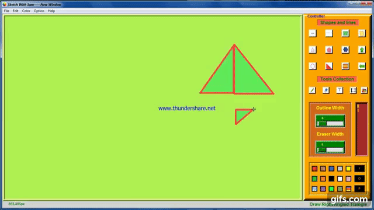

---
### <p align="center" style="color: blue">***Hello Programmers, Here I made a Drawing Application <p align="center" style="color: red">Sketch With Sam</p> <p align="center" style="color: blue">Using</p> <p align="center" style="color: red">Python Tkinter***</p></p>

<p align="center"> <br></p>

---
### <p align="left" style="color: brown">⚒️ _Important Module Used Here:_</p>
- ***_Tkinter_***
- ***_Pillow_***
- ***_Time_***


### <p align="left" style="color: brown">➡️ _Steps for Download and Install Pillow Module as:_</p>

```
1. Open Command Prompt(cmd) or Terminal
2. Write as-->
        pip install pillow
```

---


# <p style="color: Blue"> ***_💡 Functionality I Provide Here:_***</p>
## ***_<p style="color: green"> ➡️ 1. Tools Present in Shapes and Lines Section:_***</p>
- [x] ***_Straight Line_***
- [x] ***_Bent Line_***
- [x] ***_Dotted Bent Line_***
- [x] ***_Rectangle_***
- [x] ***_Rounded Rectangle_***
- [x] ***_Parallelogram_***
- [x] ***_Traingle_***
- [x] ***_Pentagon_***
- [x] ***_Hexagon_***
- [x] ***_Up and Down Arrow_***
- [x] ***_Left and Right Arrow_***
- [x] ***_Circle_***
- [x] ***_Right Angled Traingle_***
</br></br>


## ***_<p style="color: green"> ➡️ 2.Tools Present in Tools Collection:_***</p>
- [x] ***_Pencil_***
- [x] ***_Eraser_***
- [x] ***_Text_***
- [x] ***_Selector_***
- [x] ***_Color Pen_***
</br></br>


## ***_<p style="color: green"> ➡️ 3. Width Controller:_***</p>
- [x] ***_Outline Width Controller_***
- [x] ***_Eraser Width Controller_***
</br></br>


## ***_<p style="color: green"> ➡️ 4. Index Controller:_***
### <p style="color: orange"> ***_Store the Index of Every Step of Painting_***</p></p>
</br>

## ***_<p style="color: green"> ➡️ 5. Color Box:_***</p>
- [x] ***_14 Standard Color Provided_***
- [x] ***_Colorchooser Also Provided_***
- [x] ***_Shape Specific Fill Color Selector_***
- [x] ***_Shape and Line Specific Outline Color Selector_***
- [x] ***_Permanent Fill and Outline Color Change Button_***
</br></br>


## ***_<p style="color: green"> ➡️ 6. Other Important Facility Provided Here:_***</p>
- [x] ***_New File Open_***
- [x] ***_Open an Existing File_***
- [x] ***_Save the Current File_***
- [x] ***_Cut_***
- [x] ***_Copy_***
- [x] ***_Paste_***
- [x] ***_Undo_***
- [x] ***_Clear_***
- [x] ***_Background Color Change_***
- [x] ***_Zoom Controller_***
- [x] ***_Screenshot_***
- [x] ***_Shape and Line Movement With Index No._***
- [x] ***_Shortcut Key Provided_***
</br>

---
### <p align="left" style="color: #FF00FF">💡 Click On the Star If You Love this Project and Follow me on Github To get New Project Updates</p>


- ###  [Application Related Video Link](https://youtu.be/-HGEMEfffe8 "LCO")

- ###  [Follow Me on LinkedIn To Get Regular Project Updates](https://www.linkedin.com/in/samarpan-dasgupta-4aa1061b0/ "LCO")
 
