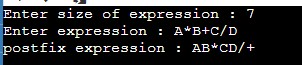

 


# 📚📚Infix to Postfix Expression Evaluation📚📚
## What is Infix Expression❓❓❓
_**Infix: The typical mathematical form of expression that we encounter generally is known as infix notation. In infix form, an operator is written in between two operands.
_**For example: 
_**An expression in the form of A * ( B + C ) / D is in infix form. This expression can be simply decoded as: “Add B and C, then multiply the result by A, and then divide it by D for the final answer.**_

## What is postfix expression❓❓
_**Prefix: In prefix expression, an operator is written before its operands. This notation is also known as “Polish notation”.

_**For example, The above expression can be written in the prefix form as / * A + B C D. This type of expression cannot be simply decoded as infix expressions...**_


```javascript
if(Have Idea)
{
Then issue your idea and contribute to the project..
Don't know how to contribute or create issue..😧😧
No Problem😎😎link provided below👇
}
```
## [How to Contribute or Create Issue](https://github.com/Kushal997-das/Project-Guidance/blob/main/CONTRIBUTING.md) and [Code of conduct](https://github.com/Kushal997-das/Project-Guidance/blob/main/CODE_OF_CONDUCT.md) .
## Note: Kindly Read How to use File Before use..
