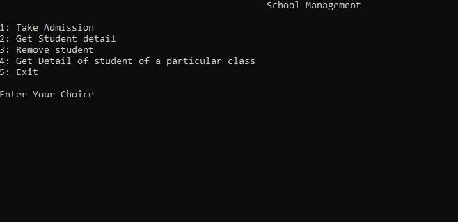
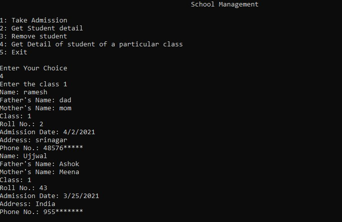
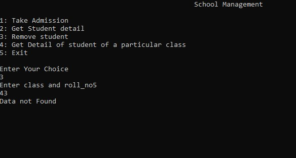
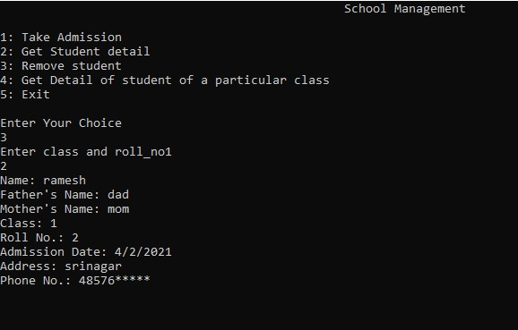

 


# **_🏫School-Management🏫_**
# What is **_School Management_**??🤔
## The System Which is used to **_manage school_** working way is called [School Management](https://www.youtube.com/watch?v=GfgdNpoxMSc&t=44s) i.e. like a student take admission,teacher in school,classes in school etc.
# Need Of **_School Management_** ??
## As We all know that when we organize any work in a right manner it help us in many ways i.e. **Easy to access, Easy to read , Easy to Rewrite , And take less time than before**. Like this management project helps to make work easy and look simple.
`Properties` | `Value`
----------- | -----------
`Developer:` | `Ujjwal Gupta`
`App Version` | `1.00.00.1`
<br/>






```javascript
if(You Want contribute)
{
click on how to contribute
Thanks for contributing😊😊😊😊😊
}
```
<a href="https://github.com/Kushal997-das/Project-Guidance/blob/main/CONTRIBUTING.md"></a> <br> <br>
# Show your _Love_ by Staring Some of My repos💖💖
