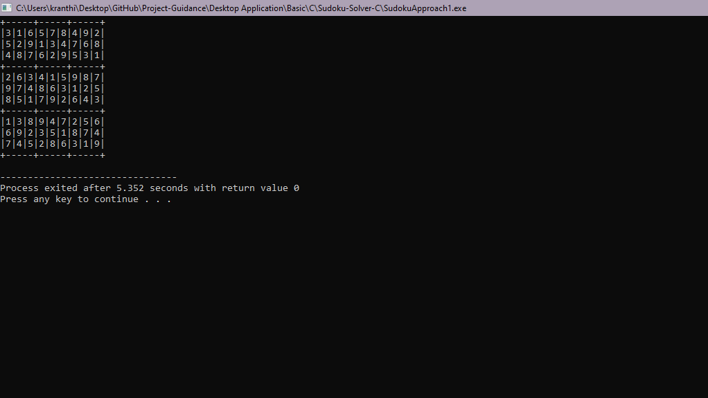

# Sudoku Solver: 🧩
# About:🚀 
* A partially filled 9*9 2D array 'grid[9][9]' will be given, the goal is to assign digits (from 1 to 9) to the empty cells so that every row, column, and subgrid of size 3 *3 contains exactly one instance of the digits from 1 to 9. 

# Motivation: 🤩
* Solving the Sudoku puzzle has become everyone’s passion. The simplicity of the puzzle’s structure and the low requirement
of mathematical skills caused people to have an enormous interest in accepting challenges to solve the puzzle. And for me, it's even more exciting to automate this process of solving a sudoku puzzle so that it could be even solved by computer programming. In this feature, I will provide a brute force algorithm along with backtracking the most efficient one.

# Implementation: 📈
* <b>Approach-1: | [CODE SNIPPET](https://github.com/Kranthi-Guribilli/Sudoku-Solver-C/blob/main/Sudoku|Approach1.c)</b>
  <i>
  * The naive approach is to generate all possible configurations of numbers from 1 to 9 to fill the empty cells.
  * Try every configuration one by one until the correct configuration is found, i.e. for every unassigned position fill the position with a number from 1 to 9.
  * After filling all the unassigned position check if the matrix is safe or not. If safe print else recurs for other cases.</i>
  
* <b>Approach-2: | Backtracking | CODE SNIPPET([C](https://github.com/Kranthi-Guribilli/Sudoku-Solver-C/blob/main/Sudoku|Backtracking.c)</b>|[C++](https://github.com/Kranthi-Guribilli/Sudoku-Solver-C/blob/main/Sudoku|Backtracking.cpp))
  <i>
  * Sudoku can be solved by one by one assigning numbers to empty cells. Before assigning a number, check whether it is safe to assign.
  * Check that the same number is not present in the current row, current column and current 3X3 subgrid.
  * After checking for safety, assign the number, and recursively check whether this assignment leads to a solution or not.
  * If the assignment doesn’t lead to a solution, then try the next number for the current empty cell.
  * And if none of the number (1 to 9) leads to a solution, return false and print no solution exists.</i>
  
  # Output
  
