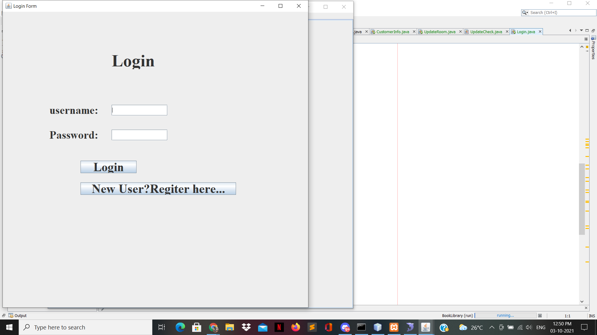

# Book Library Management System

It is a desktop application developed using Java Swing. Here the librarian can maintain the status of the books in the library like the count of books in library date of adding the book in library. Librarian can also maintain the issue and return date of the book of a particular person and a user can borrow upto 2 books at a time this feature is also implemented in it.

## Tools to run the project
- Netbeans IDE
- XAMPP to run database

## Screenshots

