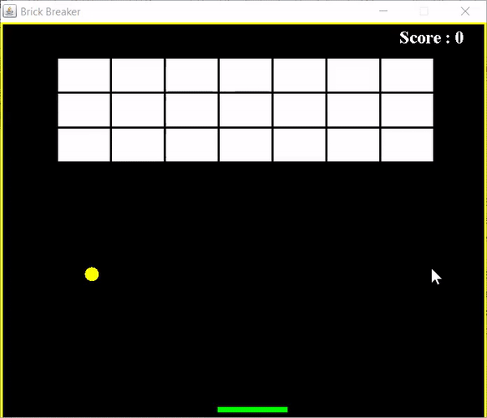

# BrickBreaker

BrickBreaker is a Desktop application where user breaks the bricks with a ball and if the ball goes out of screen the game is over. Here I have used JFrame and JPanel for drawing different graphics to make this game work perfectly.

 
