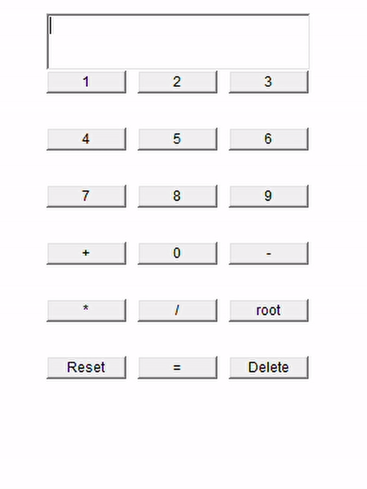

# Mini-calculator-using-Java-GUI
A small non-scientific calculator built using Java AWT Package. The program makes use of various object-oriented programming methodologies such as inheritance (inheriting the Frame class and implementing the ActionListener interface), anonymous class, polymorphism (method overriding and overloading), etc.

## Features

- Contains digit buttons from 0-9.

- Basic arithmetic operations that can be performed:
   
   + Addition ('+')
   + Subtraction ('-')
   + Multiplication ('*')
   + Division ('/')
   + nth root of any number ('root')
 
 - Additional features:
   
   + '=' sign to perform the selected operation and get the output on screen/textfield.
   + 'Delete' to delete one character at a time.
   + 'Reset' to clear the entire screen/textfield (functions as All Clear). 
   + A label "Error occured" may appear in case there is a 'division by zero' error. In case it doesn't, then the screen/textfield shows "Infinity".
   
## Test Example

