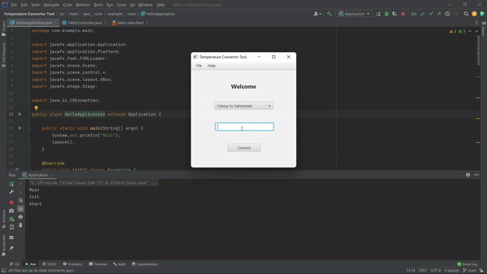

# Temperature Convertor Tool

A simple desktop application made in java using different concepts of object-oriented programming and JavaFX that converts the temperature entered by the user from celsius to Fahrenheit and vice - versa.

### Temperature Convertor Tool in Java

### Connect With Me

