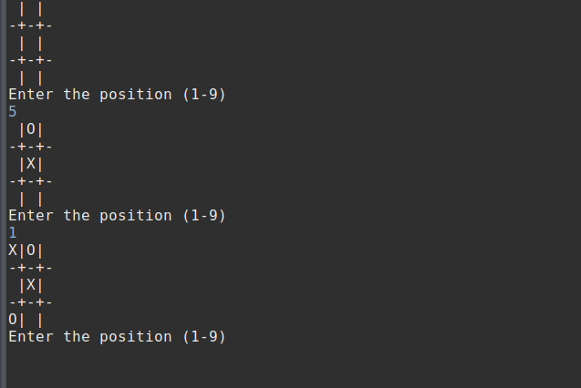
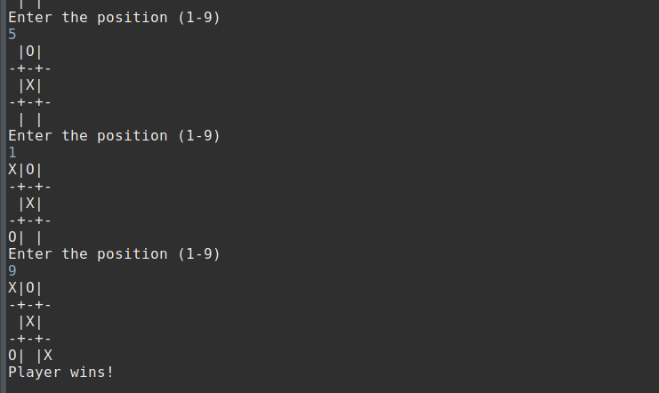

# TicTacToe 

TicTacToe is a simple game where you have to get a sequence of x or o to win the game.

-It is played with cpu, if player makes completes the sequence first it prints player won on console,
if cpu wins it prints cpu wins else the game is draw.

-This is beginner friendly project

# Screenshot

