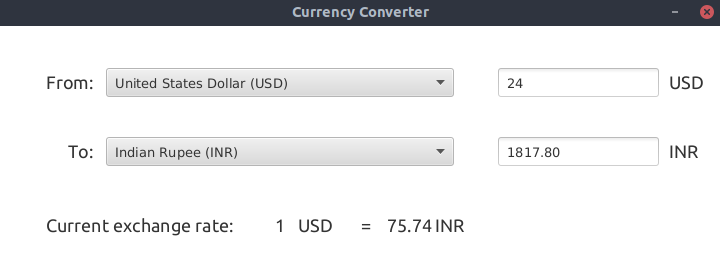
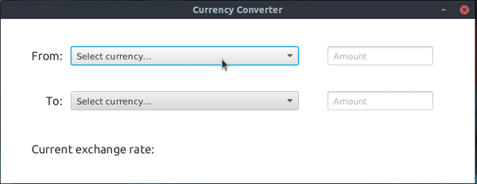

# Currency Converter

<p align="center">

</p>

It is the GUI Currency Converter written in Java with the help of JavaFX. In currency converter we can interconvert currencies.

## **Quick Start**
- Clone this repository

``` 
git clone https://github.com/Kushal997-das/Project-Guidance.git
```

- Change Directory

```
cd Project-Guidance/Desktop\ Application/Basic/Java/currency-converter
```
## **Installation and Dependencies**
This project uses maven for its dependency management. Hence, there is no need for installing the dependencies manually.

#### Installing maven -
- Download and install from https://maven.apache.org/download.cgi (Windows)
- `sudo apt install maven` (Debian linux)
- `sudo yum install maven` (Fedora linux)
- Make sure maven is included in the `PATH` environmental variable

#### Running the application 
- `mvn clean javafx:run`

#### Deploying the application
- `mvn package`
- Check the output log to see where the application was deployed
- Install JavaFX on your computer locally
- Run the produced jar file in the target folder to execute the application
- Ensure that `java-17` is installed
- Command - `java --module-path /path/to/javafx/lib --add-modules javafx.controls,javafx.base,javafx.fxml -jar outputfile.jar`

## Packages used

### JavaFX
JavaFX from `org.openjfx` is used to provide the  

### JSON
This project also uses `org.json`'s `JSONObject` class for parsing requests from the API

## Working

<p align="center">

</p>

Using the calculator is much simpler because we have to use the graphical components like buttons, drop down menus etc.

# Tech Stack
- Java
- JavaFX
- JSON

# API
- fixer.io
- freecurrencyapi.net

**Author : Rajdip Bhattacharya**
