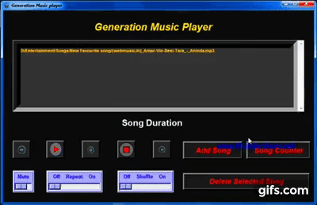

## <p align="center"> ***_Introducing My New Project Generation Music Player_*** </p>

<p align="center"></p>

---
### <p align="center">💡 ***_This is a Multi-Functioning Music Player, a Basic Project in Python_*** 💡</p>

### ➡️ ***_<u>Features are:-</u>_***
- #### ***_Play Song_*** 
- #### ***_Pause Song_*** 
- #### ***_Mute a Song_*** 
- #### ***_Play Next Song_*** 
- #### ***_Play Previous Song_*** 
- #### ***_Shuffle_*** 
- #### ***_Repeat_*** 
- #### ***_Add Songs to the Playlist_*** 
- #### ***_Count the Total Song in the Playlist_*** 
- #### ***_Live Song Duration_*** 
- #### ***_Shortcut Key to take Control Easily_*** 

---

### 💻 ***_<u>Shortcut Key for Easy Control:-</u>_*** 
- ### ***_<u>Functionality-------Shortcut Key</u>_***
- #### ***_Next Song---------------->Right Arrow Key_***
- #### ***_Previous Song---------------->Left Arrow Key_***
- #### ***_Pause Song--------------------->Spacebar_***
- #### ***_Play Song After Pause--------------------->Spacebar_***
- #### ***_Stop Song--------------------->ESC_***
- #### ***_Delete All Song --------------------->Del_***


---

### ⚒️ ***_<u>Python Module Used Here:-</u>_*** 
- #### ***_Tkinter_***
- #### ***_Pillow_***
- #### ***_Time_***
- #### ***_Pygame_***
- #### ***_Mutagen_***

---

### 🎯 <u>***_Module That you have to Install Manually:-_***</u>
### 1. ***_Pillow_***
```<p align="center>
Pillow is a Python Imaging Library (PIL), which adds support for opening, manipulating, and saving images. The current version identifies and reads a large number of formats. Write support is intentionally restricted to the most commonly used interchange and presentation formats.
```
#### 🎯 Install Pillow by writing `pip install pillow` in your ***cmd or Terminal***
🎯
[To see Pillow Documentation Click Here](https://pypi.org/project/Pillow/)

### 2. ***_Pygame_***
```<p align="center>
Pygame is a free and open-source cross-platform library for the development of multimedia applications like video games using Python. It uses the Simple DirectMedia Layer library and several other popular libraries to abstract the most common functions, making writing these programs a more intuitive task.
```
#### 🎯 Install Pygame by writing `pip install pygame` in your ***cmd or Terminal***
🎯
[To see Pygame Documentation Click Here](https://pypi.org/project/pygame/)

### 3. ***_Mutagen_***
```<p align="center>
Mutagen is a Python module to handle audio metadata. It supports ASF, FLAC, MP4, Monkey’s Audio, MP3, Musepack, Ogg Opus, Ogg FLAC, Ogg Speex, Ogg Theora, Ogg Vorbis, True Audio, WavPack, OptimFROG, and AIFF audio files. All versions of ID3v2 are supported, and all standard ID3v2.4 frames are parsed. It can read Xing headers to accurately calculate the bitrate and length of MP3s. ID3 and APEv2 tags can be edited regardless of audio format. It can also manipulate Ogg streams on an individual packet/page level.
```
#### 🎯 Install Mutagen by writing `pip install mutagen` in your ***cmd or Terminal***
🎯
[To see Mutagen Documentation Click Here](https://pypi.org/project/mutagen/)

---
### <p align="center">***_Show  by Starring this Repo_***</p>

- ### ***_[Click to View the Project Video](https://youtu.be/Q-YHVdA9pe0)_***

- ### ***_[Connect With Me on LinkedIn to Get Regular Project Updates](https://www.linkedin.com/in/samarpan-dasgupta-4aa1061b0/ "LCO")_***
