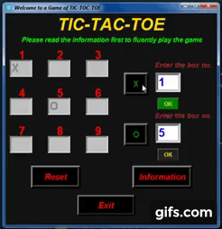

## 
***_Introducing My New Project Tic-Tac-Toe Game_*** 

### ***_This game is for Human vs Human_***

***

### 
***_Show Love by Starring this Repo_***

- ### ***_[Click to View the Project Video](https://youtu.be/Nw1uP5n_eaw)_***

- ### ***_[Connect With Me on LinkedIn to Get Regular Project Updates](https://www.linkedin.com/in/samarpan-dasgupta-4aa1061b0/ "LCO")_***