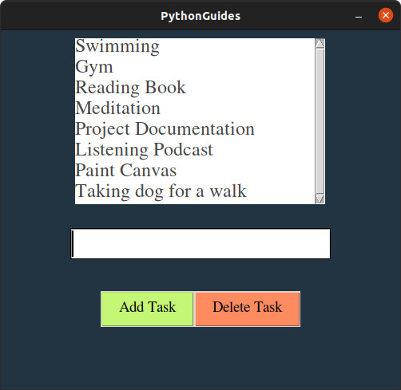

# To-Do List
* Python To-Do List is a software that holds information about upcoming tasks or events.
* Users need a handy software that can be used quickly for taking quick notes. And that is where the To-Do list is used.

## Install
To install Tkinter module-
```bash
pip install tk
```

## Usage

```bash
python3 main.py
```
**To add task**
* Select the input box -> give input -> click on Add Task.

**To delete task**
* Select the task to be deleted -> click on Delete Task.

## Required Modules

* Python Tkinter

## Working Example




<hr>