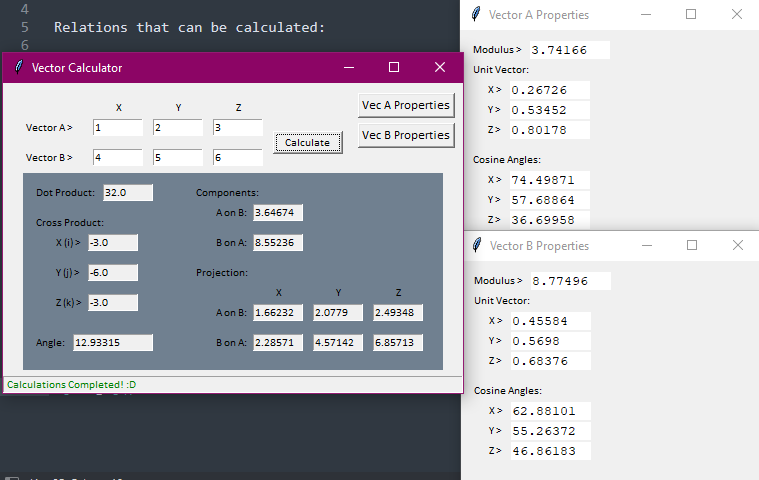

# Vector Calculator

Vector Calculator GUI based app built using Python that can fetch relation between 2 vectors along with the properties of each vector alone.

Relations that can be calculated:

* Dot product.
* Cross product.
* Angle between both vectors.
* Component of each vector on the other.
* Projection of each vector on the other.

Properties that can be calculated:

* Unit Direction of each vector.
* Cosine Direction of each vector.
* Cosine Angles of each vector.
* Absolute Value of each vector. |A|

## Required modules

* Tkinter

## Screenshots

