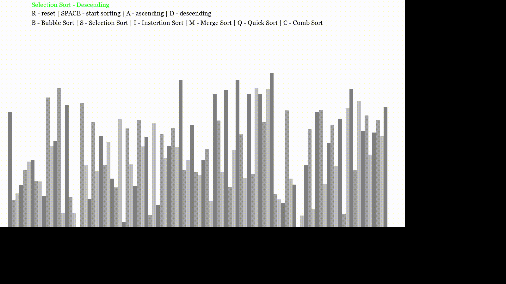
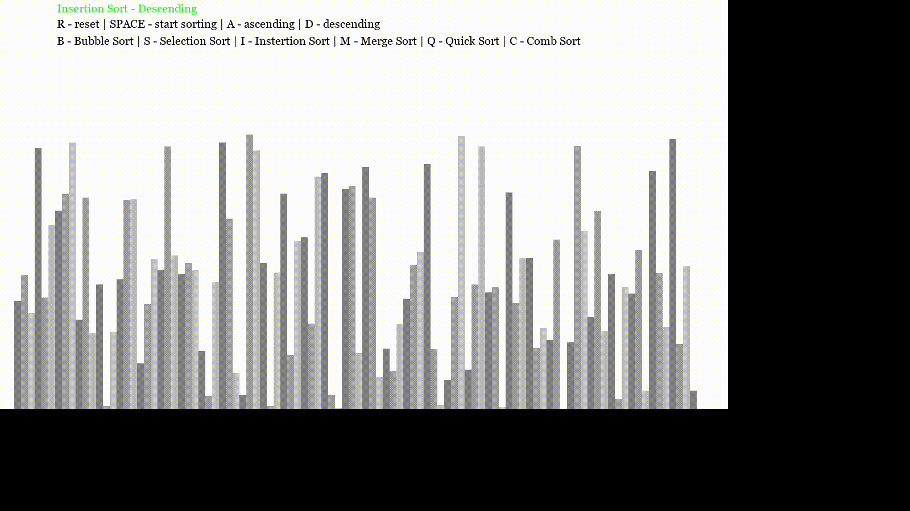
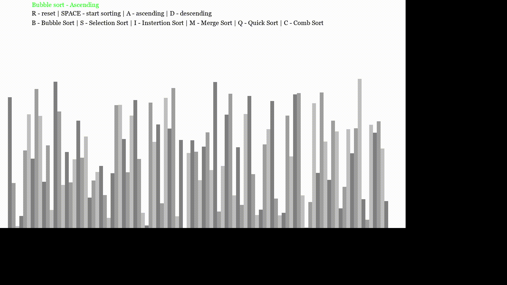
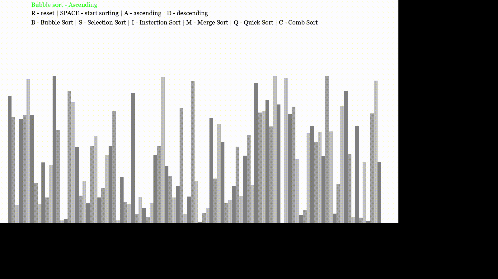
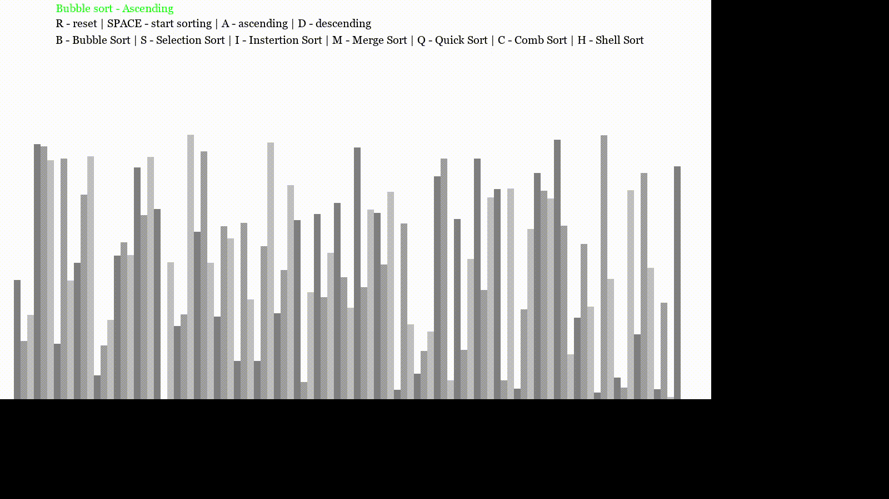
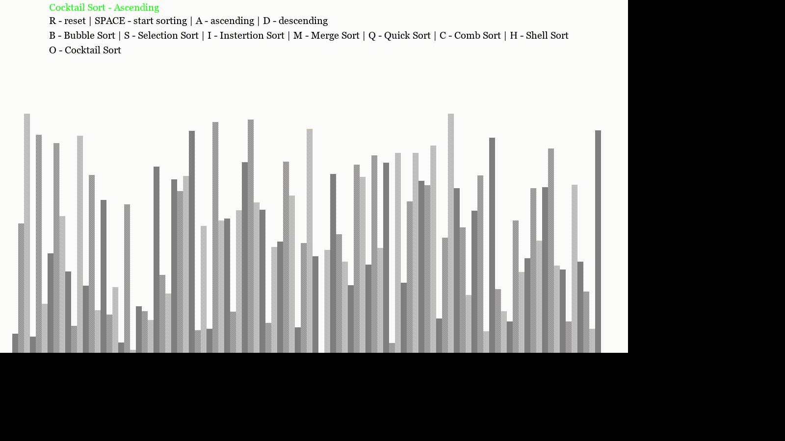

# <h2 align = "center">Hello Programmer's</h2><br><br>

# <p align = "center">I made a Algorithm Visualiser with the help of pygame module in python, contains mostly all the famous sorting algorithms.</p>


# ➡️ Getting Started 

* Fork this repository and clone it.
* Run the Python file ```visualiser.py```
* And then you are good to proceed and visually enjoy the different sorting algorithms.
#

#  <----💡 Algorithms implemented 💡---->

## ➡️ 1. 
* 

## ➡️ 2. 
* 

## ➡️ 3. 
* 


## ➡️ 4. 
* 

## ➡️ 5. 
* 

## ➡️ 6. 
* 


## ➡️ 7. 
* 

## ➡️ 8. 
* 
#

# <p align="center">💡 ***_Links_*** 💡</p>
## [Connect with me 😀](https://www.linkedin.com/in/debayan-pradhan-b138641b4/)
## [My github ⭐](https://github.com/Phoenix-031)