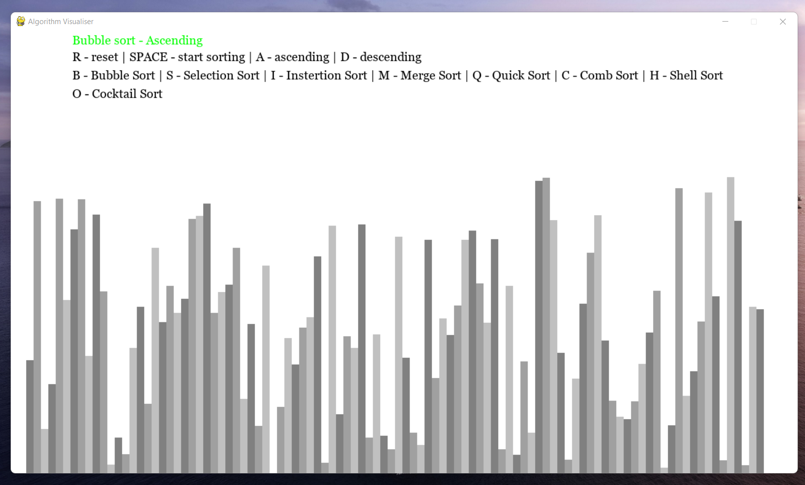

# <h2 align = "center">Hello Programmer's</h2><br><br>

# <p align = "center">I made a Algorithm Visualiser with the help of pygame module in python, contains mostly all the famous sorting algorithms.</p>




# ➡️ Getting Started 

* Fork this repository and clone it.
* Run the Python file ```visualiser.py```
* And then you are good to proceed and visually enjoy the different sorting algorithms.
#

#  <----💡 Algorithms implemented 💡---->

## ➡️ 1. 

https://user-images.githubusercontent.com/55997552/156937070-1e67eee7-fe1a-4ba8-ab73-0b85f7b6e2e1.mp4


## ➡️ 2. 
* 
https://user-images.githubusercontent.com/55997552/156937078-e5fe25e0-245b-46af-b77f-5e883c7bf062.mp4


## ➡️ 3. 
* 
https://user-images.githubusercontent.com/55997552/156936847-2e2cf2fb-64ee-4b98-b436-7fe8584bc08a.mp4


## ➡️ 4. 

https://user-images.githubusercontent.com/55997552/156936955-b188c107-2a56-4685-90b7-08cc10c9b90d.mp4


## ➡️ 5. 

https://user-images.githubusercontent.com/55997552/156937232-d1663441-25db-45be-ab55-471880c21252.mp4


## ➡️ 6. 


https://user-images.githubusercontent.com/55997552/156937040-d46a6f9d-f7b2-431f-a042-2a1b77eb8ec6.mp4


## ➡️ 7. 

https://user-images.githubusercontent.com/55997552/156937034-0fc83b53-bd5b-4593-ab66-987ed13cecaa.mp4


## ➡️ 8. 

https://user-images.githubusercontent.com/55997552/156936968-40a0555e-ede1-4ffe-a523-97ba3bb135c5.mp4

#

# ➡️ How to play around

## 1.R/r --> wil reset bars on the screen
## 2. Space --> will start visualisation of the algorithm that's mentioned at the top of the screen

## 3. A/a --> will set ascending as the sorting order
## 4. D/d --> will set descending as the sorting order

## 5. B/b --> will set the sorting algrithm as bubble sort (default algrithm when the app starts)
## 6. S/s --> will set the sorting algo as selection sort

## 7. I/i --> will set the sorting algo as the insertino sort
## 8. M/m will set the sorting algo as merge sort

## 9. Q/q --> will set the sorting algo as quick sort
## 10. C/c --> will set the sorting algo as comb sort

## 11. H/h --> will set the sorting algo as shell sort
## 12. O/o --> will set the sorting algoa as cocktail sort

<br>

# *Note: U can change the number of bars that appear by changing the value of (n) in the main_loop function 
#
# So Select the Algorithm and hit the SPACE and enjoy!!


# <p align="center">💡 ***_Links_*** 💡</p>
## [Connect with me 😀](https://www.linkedin.com/in/debayan-pradhan-b138641b4/)
## [My github ⭐](https://github.com/Phoenix-031)
