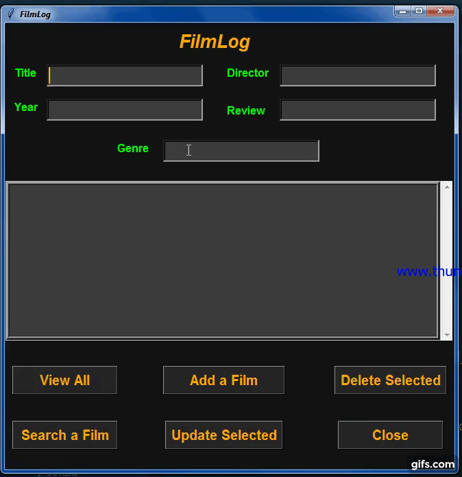

## 
💻 Presenting New Project FLIMLOG 💻

---

## ***_🎯 Description_***
### _Log a film to tell us you watched it on a particular date, and to attach a review, rating and tags. We put all films you log with a date into your Diary, a great reference for when it comes time to compile your year-end list._

---

- ## ***_💡 Imporant Modules Used Here_***
- ### ***_Tkinter_***
- ### ***_sqlite3_***

---

## 
 ***_Support Me By Starring My Repos_***
 
