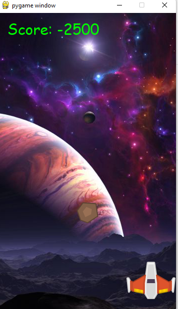

<p align="center">
    
  </a>
</p>
<h1 align="center">Space war Game </h1>

<div align="center">
Fight in space 

</div>

<br />

<div align="center">
  <!-- Standard -->
  <a href="https://standardjs.com">
    
  </a>
</div>

## ⚡️  Introduction
Move right or left to be save from metroid

# ✅ Install Dependecies:
  - You must have Python 3.8.3 or above. I expect everyone will have it. If not then update it now what are you waiting for.
  - Install Python 3.9.0 or above.
  - Further Install this all Libraries using terminal : <br>
    ```pip install pygame```

