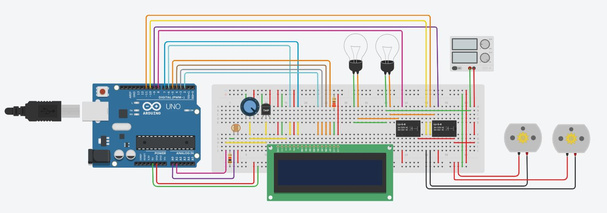

# Home Automation

## Aim

To design a Arduino Based Home Automation System

## Purpose

This project deals with the working of home automation.

## Components Required

* Arduino UNO
* Breadboard
* Connecting Wires
* LCD 
* Potentiometer
* DC Motors
* Bulbs
* Relays
* Photoresistor
* Temperature Sensor
* Power Supply
* 2 Resistors

## Short Description 

In this project, we are using bulbs, DC motors as fans for home automation. These bulbs, fans works according to the data read from the photoresistor & temperature Sensor by the Arduino UNO.

## Workflow of the Project

- The DC motors acts like the fans. 
- The values of the temperature sensor and photoresistor are read by the Arduino
  - If the temperature is high and light is more
    - Bulbs are turned off
    - Fans are turned on
  - If the temperature is low and light is more
    - Bulbs are turned off
    - Fans are turned off
  - If the temperature is high and light is less
    - Bulbs are turned on
    - Fans are turned on
  - If the temperature is low and light is less
    - Bulbs are turned on
    - Fans are turned off 
- All messages are displayed on the LCD screen along with the current temperature.

## Setup instructions

- Design and assemble the circuit as shown in the image.
- Check the connections of all the components.
- Upload the code.
- Start the simulation

## Output

[Simulation Video](./Images/home_automation.mp4)

