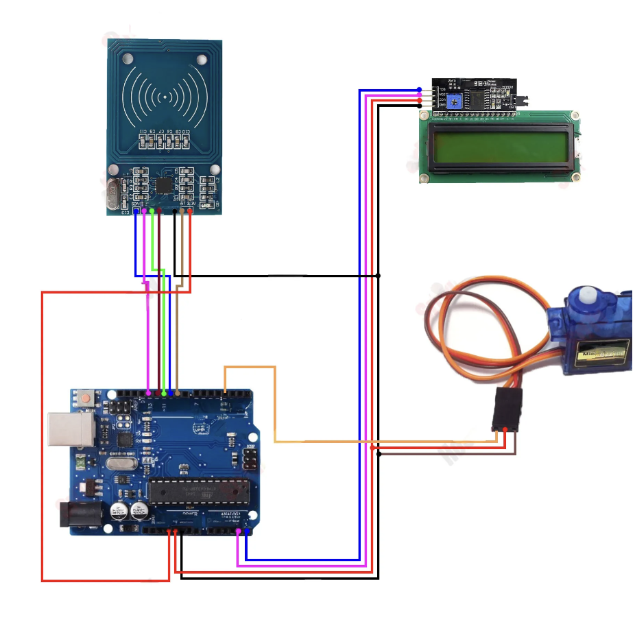

# RFID Door Lock System

This project demonstrates how to build an RFID-based door lock system using Arduino. The system allows users to unlock a door by scanning an RFID tag. It displays the status on an LCD and uses a servo motor to actuate the door lock.

## Components Required

- **Arduino UNO** x 1
- **RFID Module (MFRC522)** x 1
- **LCD Display (16x2)** x 1
- **I2C Module for LCD** x 1
- **Servo Motor (SG90)** x 1
- **Door Lock Mechanism** x 1
- **Foamboard** (for mounting components)
- **Iron Stick** (for mounting or securing the lock)
- **Jumper Wires**

## Folder Structure

```bash
├── main.ino              # Main code to run the RFID door lock system
├── scan
│   └── scan.ino          # Script to scan and get the UID of the RFID tag
└── circuit-diagram.png   # Circuit diagram for the hardware connections
```

## Circuit Diagram

The circuit diagram is provided in the `Circuit.png` file in the project directory. It outlines the connections between the Arduino, RFID module, LCD display with I2C module, servo motor, and other components.



### Software Setup

1. Download or clone the repository with the project files.
   
2. Open the **`scan.ino`** in the Arduino IDE to scan the RFID tags. After obtaining the tag's UID, modify **`main.ino`** to add the UID to the list of authorized UIDs.

3. Open **`main.ino`** in the Arduino IDE. Upload the code to your Arduino UNO.

4. After successful upload, the system will be ready to detect authorized RFID tags and operate the door lock.

### Modify the Code

- **Adding RFID Tags**: In `main.ino`, you will find a string of authorized UIDs. Add the UID of your RFID tag to this string to grant access.
`String UID = "15 75 FE 28";`

- **Adjusting Servo Motor Movement**: You can modify the angles for locking and unlocking the door by changing the values of the servo's position in the code.

## Troubleshooting

- **Servo not moving**: Ensure that the servo is properly connected and powered. Double-check the pin connections and the power supply.
- **UID not detected**: Verify that the RFID module is wired correctly. You can use the `scan.ino` script to check if the RFID reader is detecting tags properly.
