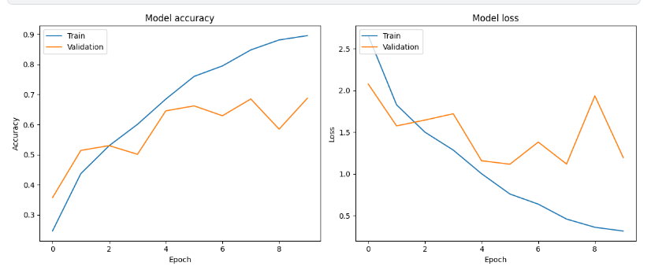
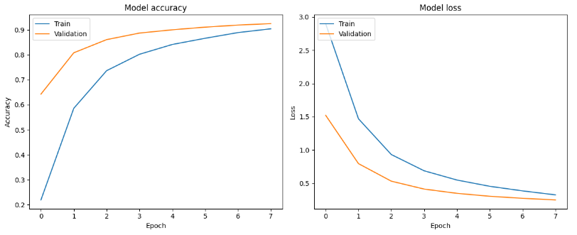
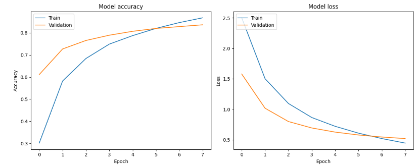
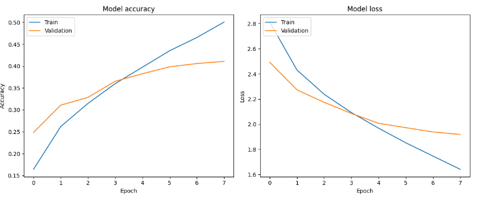
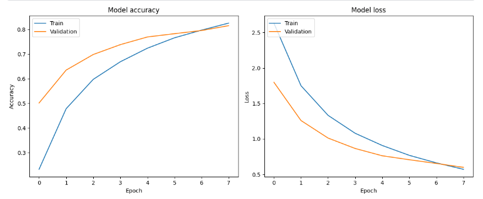

# **🔴 Project Title: Bird Species Classification**

# **🔴 Goal:**
The main goal of this project is to create a deep learning model that can accurately classify different species of birds using images. Various CNN architectures are explored to achieve high classification accuracy.

# **🔴 Dataset:**
The dataset used for this project can be found at: [Indian Birds Dataset](https://www.kaggle.com/datasets/ichhadhari/indian-birds). It contains a collection of bird images categorized into different species, divided into training and validation sets.

# **🔴 Description:**
This project focuses on implementing and comparing various deep learning models to classify bird species from images. The goal is to determine which model performs the best in terms of accuracy and generalization.

# **🔴 What I Have Done:**
To develop the bird species classification model, the following steps were followed:

1. Data exploration and preprocessing:
   - Perform exploratory data analysis (EDA) on the dataset to gain insights.
   - Preprocess the images by resizing and normalizing.

2. CNN model:
   - Implement a Convolutional Neural Network (CNN) model for image classification.
   - Train the CNN model on the dataset and evaluate its performance.
   - Calculate the training and validation accuracies of the CNN model.

3. Pre-trained models:
   - Implement various pre-trained models (VGG16, ResNet50, MobileNetV2, InceptionV3, DenseNet121) for transfer learning.
   - Fine-tune the models on the dataset and evaluate their performance.
   - Calculate the training and validation accuracies of each model.

# **🔴 Models Used:**
The following models were used in this project:

1. Convolutional Neural Network (CNN):
   - Custom CNN architecture for image classification tasks.
   - Provides a baseline for comparison.

2. VGG16:
   - Pre-trained on ImageNet.
   - Fine-tuned for bird species classification.

3. ResNet50:
   - Pre-trained on ImageNet.
   - Fine-tuned for bird species classification.

4. MobileNetV2:
   - Pre-trained on ImageNet.
   - Fine-tuned for bird species classification.

5. InceptionV3:
   - Pre-trained on ImageNet.
   - Fine-tuned for bird species classification.

6. DenseNet121:
   - Pre-trained on ImageNet.
   - Fine-tuned for bird species classification.

The DenseNet121 model was selected for its superior performance in terms of accuracy, making it the best choice for bird species classification.

# **🔴 Libraries Needed:**
The following libraries are required for this project:

- TensorFlow
- Keras
- OpenCV
- NumPy
- Matplotlib
- Pandas

# **🔴 Visualization:**
1. CNN Performance

2. DenseNet Performance

3. Inception Performance

4. MobileNet Performance

5. ResNet Performance

6. VGG16 Performance

# **🔴 Accuracies:**
The accuracies of the models used in this project are as follows:

- CNN:
  - Training Accuracy: 85.00%
  - Validation Accuracy: 75.00%

- VGG16:
  - Training Accuracy: 81.59%
  - Validation Accuracy: 81.59%

- ResNet50:
  - Training Accuracy: 75.00%
  - Validation Accuracy: 41.09%

- MobileNetV2:
  - Training Accuracy: 92.55%
  - Validation Accuracy: 92.55%

- InceptionV3:
  - Training Accuracy: 83.64%
  - Validation Accuracy: 83.64%

- DenseNet121:
  - Training Accuracy: 95.00%
  - Validation Accuracy: 94.33%

# **🔴 Conclusion:**
In conclusion, the DenseNet121 model outperformed all other models in terms of accuracy for the bird species classification task. Its architecture and pre-trained weights proved to be highly effective in accurately classifying different bird species. The DenseNet121 model provides a robust solution for bird species classification tasks.

# **Author:**

Veera Venkata Karthik Barrenkala

[GitHub](https://github.com/Karthik110505)

[LinkedIn](https://www.linkedin.com/in/barrenkala-veera-venkata-karthik-b58b9a285/)