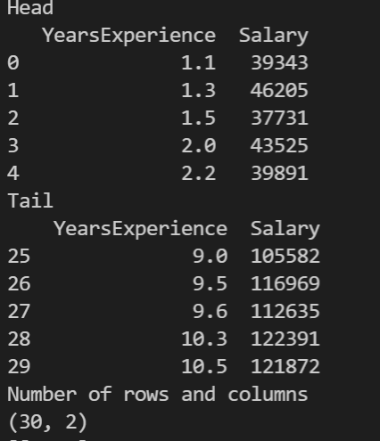
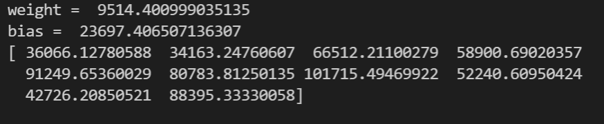
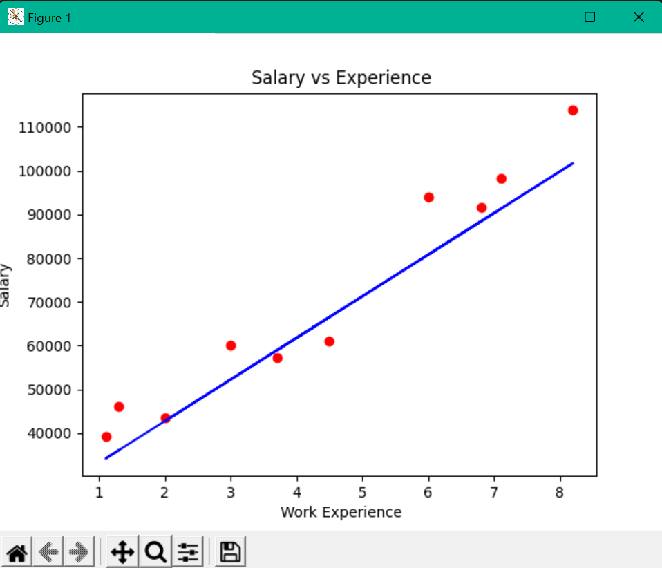

   # INTRODUCTION TO LINEAR REGRESSION:
   Machine learning in general is all about prediction. A prediction is nothing but minimizing the error in the model so that it gives accurate predictions.
  Linear regression is a statistical method which is used to predict the value of a dependent variable (y) based on the values of the independent variables (x). 
  It assumes a linear relationship
  Y=wX+b
  Y->dependent variable
  X->independent variable
  w->weight- weight is simply the importance/strength of the independent variable, 
  b->bias- bias is a constant value which is added to the dependent variable to make the model more accurate.
  In this example we will use a simple dataset which contains the years of experience and salary.
  Here, we predict the salary based on the years of experience
 salary is the target variable that should be predicted 

# LEARNING PARAMETERS: #
 The learning rate is a tuning parameter in an optimization algorithm that determines the step size at each iteration while moving toward a minimum of a loss function.
# GRADIENT DESCENT: #
 Gradient Descent is an optimization algorithm that is used to find the minimum of a function.
Why do we need to find the minimum?
To find the minimum of a function, we need to find the point where the function is minimized.
To find the optimal values of the parameters.
Gradient descent measures the slope(change in error by a change in the weight) of the function, ie it takes the derivative  of the loss function
Loss function is the error between the predicted value and the actual value. It tells you how close or far your model is from the actual prediction.

def __init__(self, learning_rate, no_of_iterations):
Here we initiate the learning rate and number of iterations for updating the weights.

def fit(self, X, Y ):

Here we fit the model to the training data.  Model fitting is a measure of how well a machine learning model generalizes to similar data to that on which it was trained

def update_weights(self):

Here we update the weights of the model to minimize the loss function.

dw = - (2 * (self.X.T).dot(self.Y - Y_prediction)) / self.m
Here we calculate the gradient of the loss function with respect to the weights.gradient is calculated by taking the derivative of the loss function with respect to the weights.

db = - 2 * np.sum(self.Y - Y_prediction)/self.m

Here we calculate the gradient of the loss function with respect to the bias.

# HEAD, TAIL AND NUMBER OF ROWS,COLUMNS: #

# WEIGHT,BIAS AND TEST DATA PREDICTION #

# OUTPUT #

