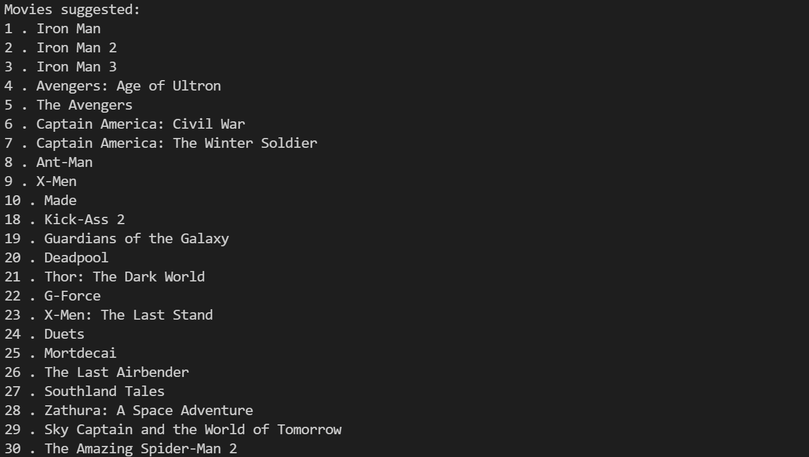

# In this project, we will be building a simple Movie Recommender System. 
I have attached the csv file of the data set that contains the following features : index	,budget	,genres	,homepage	,id	keywords,original_language	,original_title	,overview,	popularity,	production_companies,production_countries,	release_date,	revenue	,runtime,	spoken_languages,	status,	tagline	,title,	vote_average,	vote_count,	cast,	crewdirector 

Libraries used:
- Pandas
- Numpy
- Difflib
- Sklearn - feature extraction, TfidfVectorizer, Metrics, Cosine Similarity

# STEP 1
# FEATURE SELECTION:
Feature selection is the process of selecting the features that are most relevant to the problem at hand.

# STEP 2
# DATA PREPROCESSING:
Data preprocessing is the process of transforming the data into a form that is easier to work with. We replace the null values with string

# STEP 3
# Converting text to feature vectors:
Converting text to feature vectors is the process of turning text into a vector of numbers.
Tfid gives a numerical statistic for each word in a document.It is a weighting factor and tells how often a word occurs/ or words that appear important and are common in the document.

Cosine similarity function is used to calculate the similarity between two documents.The value closer to 0 indicates that the two documents have less similarity. 

# STEP 4
We get the input from the user and find the closest match using get_close_matches function. And then the similar movies are sortedbased on the similarity confidence.

similarity confident is the confidence that the two movies are similar.
Finally, We print te similar movies

