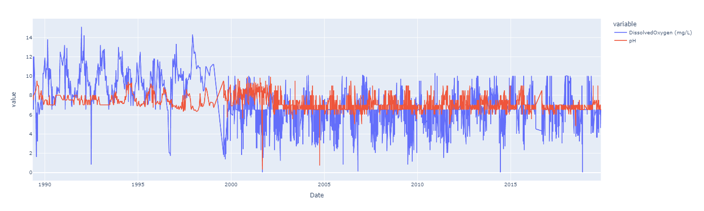
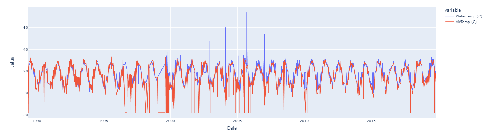
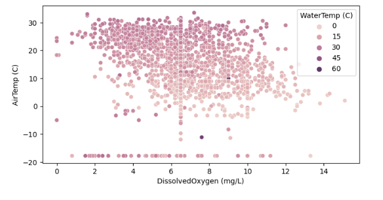
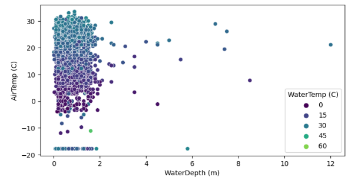

# Water Quality Data EDA

### Source of data:-

##### https://www.kaggle.com/datasets/supriyoain/water-quality-data/data

### Features in the dataset:-

<ul> <b>Date:</b> Indicates the date when the water quality data was recorded. </ul>
<ul> <b>Salinity:</b> Denotes the concentration of salts in the water. </ul>
<ul> <b>Dissolved Oxygen:</b> Indicates the amount of oxygen dissolved in the water, crucial for aquatic life. </ul>
<ul> <b>pH:</b> Represents the acidity or alkalinity level of the water. </ul>
<ul> <b>Secchi Depth (m):</b> Measures the depth at which a Secchi disk disappears from view, providing insight into water transparency. </ul>
<ul> <b>Water Depth:</b> Indicates the depth of the water column at the sampling location. </ul>
<ul> <b>Water Temperature:</b> Provides the thermal condition of the water. </ul>
<ul> <b>Air Temperature:</b> Represents the ambient air temperature during sampling. </ul>

### Example Data Visualizations:-

