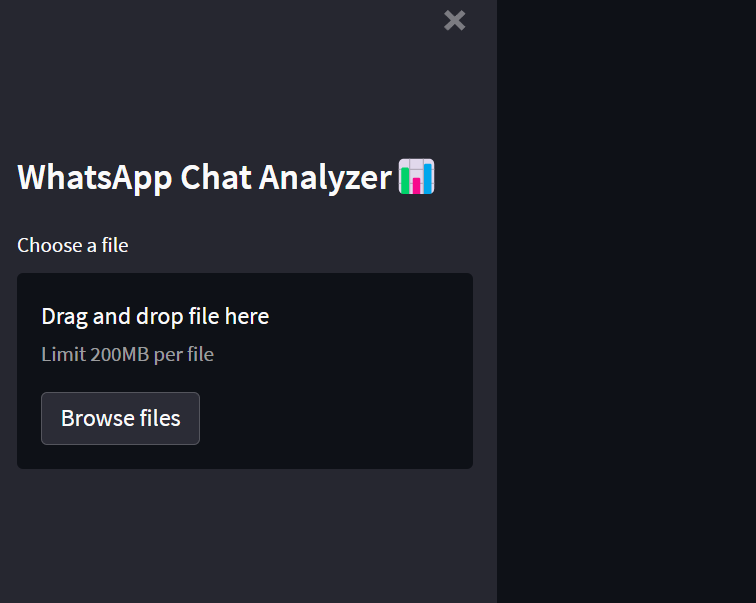

Project Workflow-->

This project is a  Whatsapp Chat Analyzer project where user can export either personal or group chat in text file and save it in its system and when uploading on application it gives you complete statistics of conversation between or among people.

Some parameter of Analyzer includes:
1-wordcloud,,
2-Monthly- Timeline,,
3- daily_timeline,,
4-Activity-map,,
5-most common words using in chat(Top 25),,
6-emoji Analysis,,
7- Heat-Map

Application runs on streamlit and deployed on heroku :
https://chat-analysis-ayushjain.herokuapp.com/

Recommended as of now - Export files should be in 12hr format

Front view of an application-
