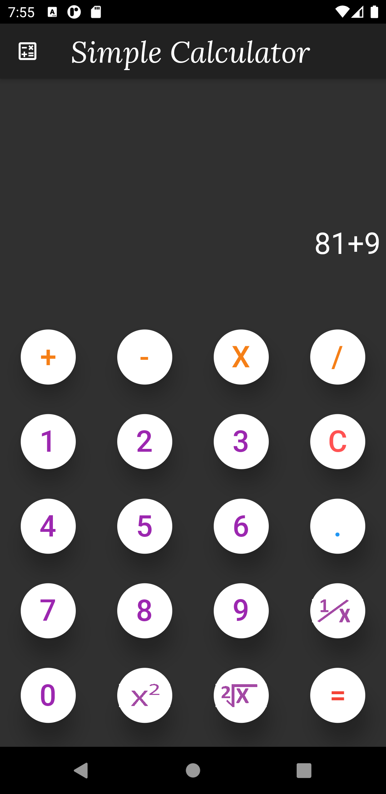
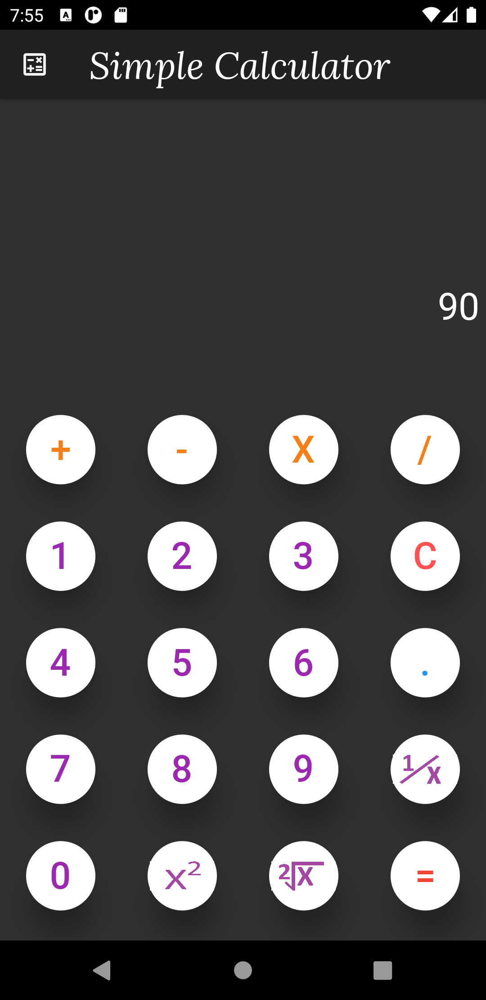

<h1 align="center">💖 My First Flutter Project 💖</h1>

 

<h3 align="center">💕 This is a Simple Calculator made in Flutter 💕</h3>

[<h4 align="center"> 📌 Install 'package:math_expressions/math_expressions.dart' Package from here by following the guidelines(This is necessary to run this app) </h4>](https://pub.dev/packages/math_expressions)

### [
💚 Click here to see Project Demo video 💚
](https://youtu.be/9Id-VMoc12E)

<h3 align="center">🙏 Show 💙 by Starring this Repo 🙏</h3>

## Getting Started

This project is a starting point for a Flutter application.

A few resources to get you started if this is your first Flutter project:

- [Lab: Write your first Flutter app](https://flutter.dev/docs/get-started/codelab)
- [Cookbook: Useful Flutter samples](https://flutter.dev/docs/cookbook)

For help getting started with Flutter, view our
[online documentation](https://flutter.dev/docs), which offers tutorials,
samples, guidance on mobile development, and a full API reference.
