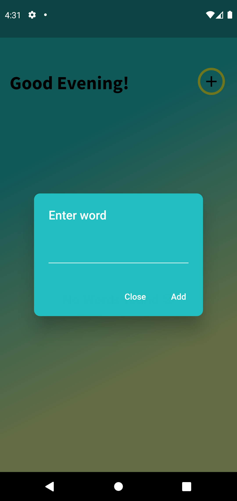

# Pocket Dictionary App

Pocket Dictionary app is an app used to add words and their meanings are stored along with the words for future reference.

## Usage

- Click on the + button on the top right corner and use the alert dialog to type in a new word and click on add.
- The word will then appear in a list on the main screen.
- Upon clicking on each word their meaning will be revealed.
