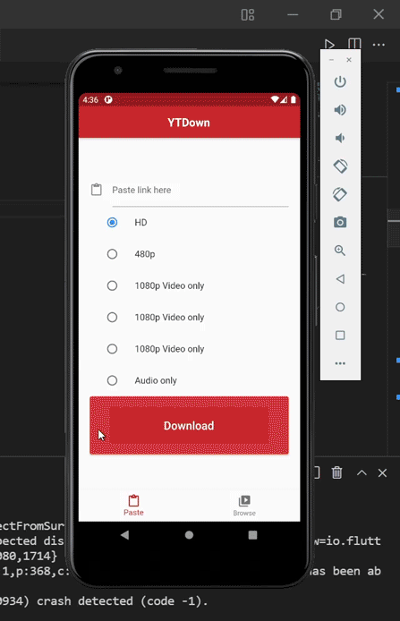

# ❣ Youtube Downloader App ❣

## Requirements to run the app:
> ### Open the source folder in your favourite code editor, preferrably VSCode or Android Studio
 

> ### Run 'dart pub get' to get all the dependencies in the terminal.

 

> ###  Now run 'flutter run' command and select the device on which you want to run the application, and enjoy. 
 
 

<h3 align="center">🙏 Show 💙 by Starring this Repo 🙏</h3>