<div align="center">
<a href="https://github.com/ZeyadTarekk/Dawrha-Shop" rel="noopener">

</a>

</div>
<div align="center">

[](https://github.com/ZeyadTarekk/Dawrha-Shop/contributors)
[](https://github.com/ZeyadTarekk/Dawrha-Shop/issues)
[](https://github.com/ZeyadTarekk/Dawrha-Shop/network)
[](https://github.com/ZeyadTarekk/Dawrha-Shop/stargazers)
[](https://github.com/ZeyadTarekk/Dawrha-Shop/blob/master/LICENSE)
[](https://img.shields.io/github/languages/count/ZeyadTarekk/Dawrha-Shop)

</div>

## 📝 Table of Contents

- [About](#about)
- [Get started](#get-started)
  - [Installation](#Install)
  - [Running](#running)
- [Technology](#tech)
- [Screenshots](#Screenshots)
- [File structure](#file)
- [Contributors](#Contributors)
- [License](#license)

## 📙 About <a name = "about"></a>

- Fullstack web application using PHP and MySQL

- We all should be responsible for protecting our environment and recycling is one of the easiest ways that we can do at home to contribute to the reduction of pollution so we decided to build an online shop that you can sell or buy recyclable items like (bottles, paper, boxes, etc.…). 
- User can enter the site and offer some items to sell and another user can interact with him to buy this item.
- The main concern of the shop is to provide a way for the consumers to get rid of their garbage with a nominal cost and help recycling companies to save the effort of separating the garbage.

## 🏁 Getting Started <a name = "get-started"></a>

> This is an list of needed instructions to set up your project locally, to get a local copy up and running follow these instructuins.

### Installation <a name = "Install"></a>

1. **_Clone the repository_**

```sh
$ git clone https://github.com/ZeyadTarekk/Dawrha-Shop.git
```

2. **_Navigate to repository directory_**

```sh
$ cd Dawrha-Shop
```

3. **_Install dependencies_**

```sh
1- You will need php installed 
```

```sh
2- XAMPP or MAMP or WAMP installed
```

### Running <a name = "running"></a>

1. **_Running on development mode_**
```sh
1- Copy the colned folder inside htdocs folder 
```
```sh
2- Start Apache and MySQL Servers
```
```sh
3- Create database with name dawrhashop
```
```sh
4- Import the file in "Database File" folder
```
```sh
5- Put your user and password in "admin/connect.php"
```

```sh
6- Go to this URL in your browser http://localhost/Dawrha-Shop/
```

## 💻 Built Using <a name = "tech"></a>

- **PHP**
- **MySQL**
- **Bootstrap**

## 📷 Demo Screenshots <a name = "Screenshots"></a>

<div align="center">
   </a>
   
   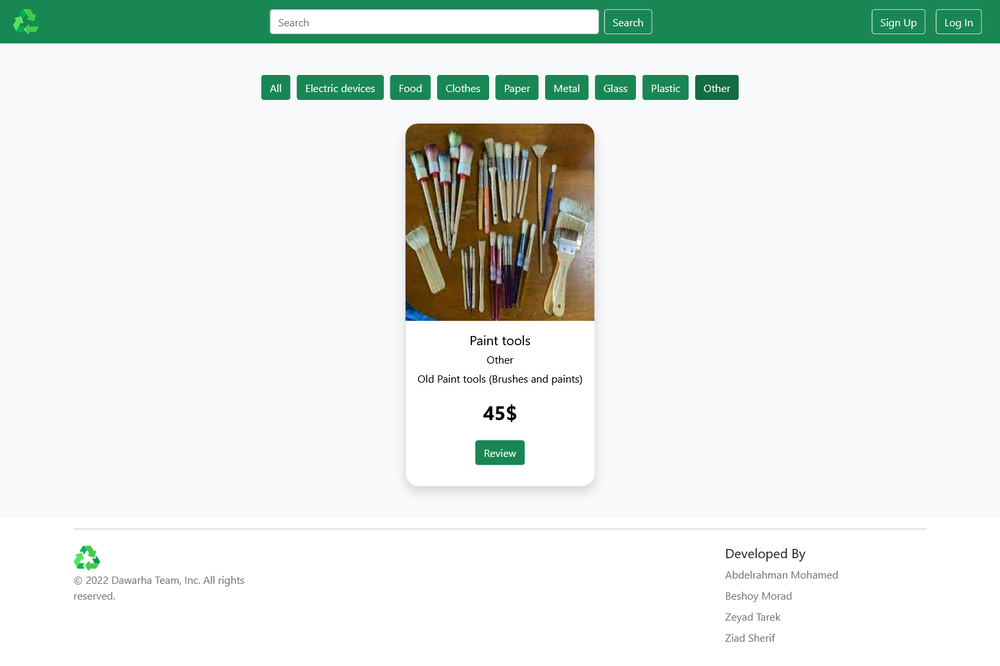</a>
   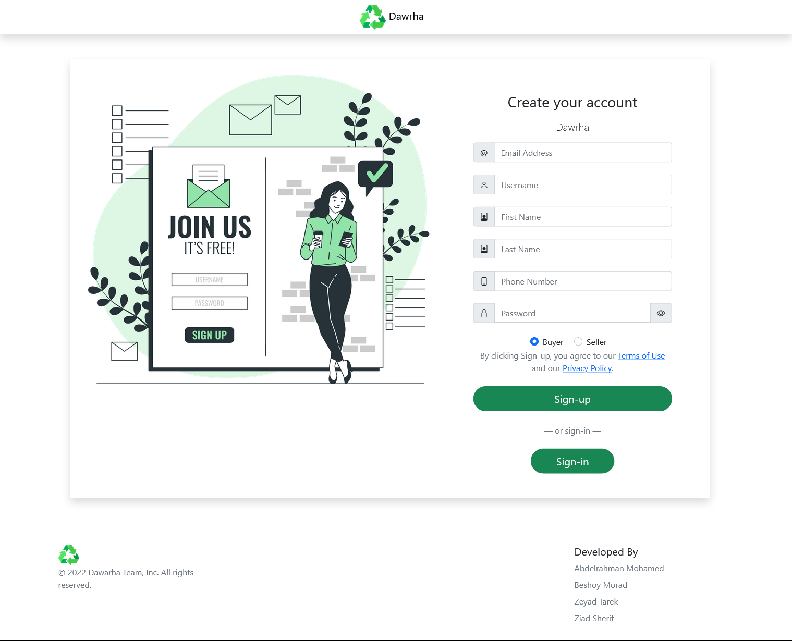</a>
   
   </a>
   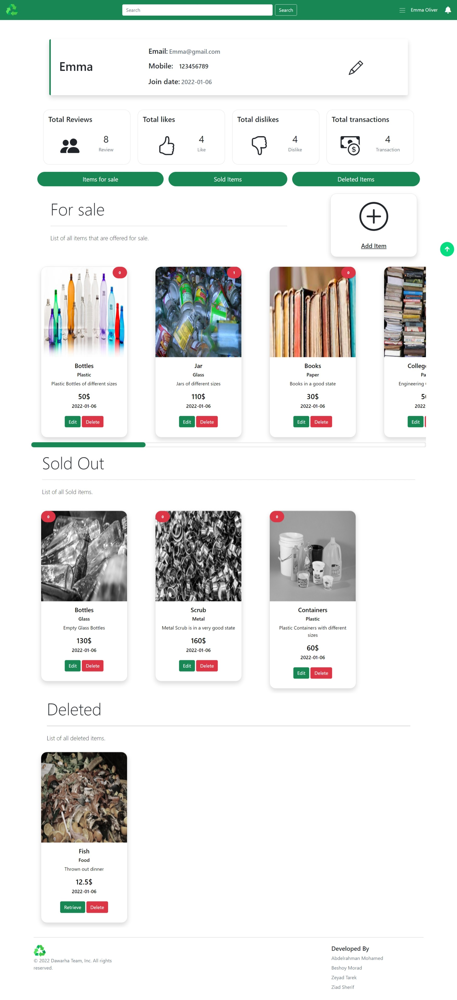</a>
   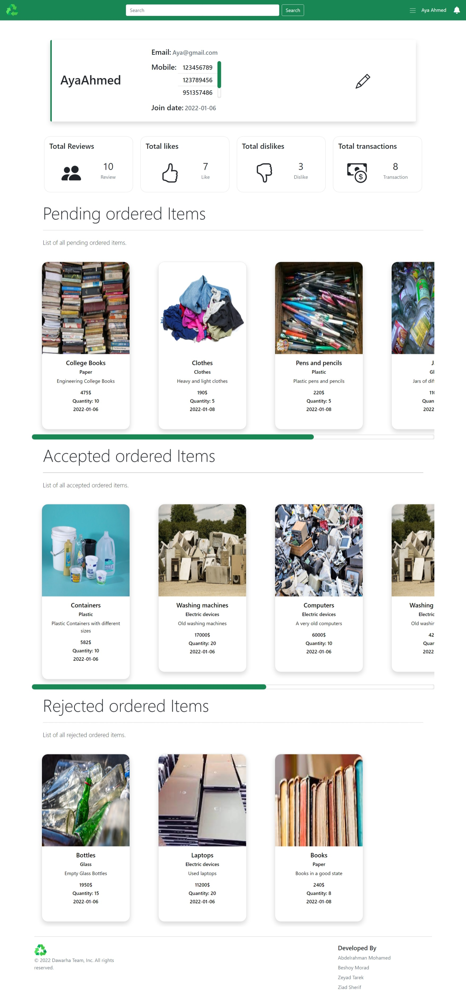</a>
   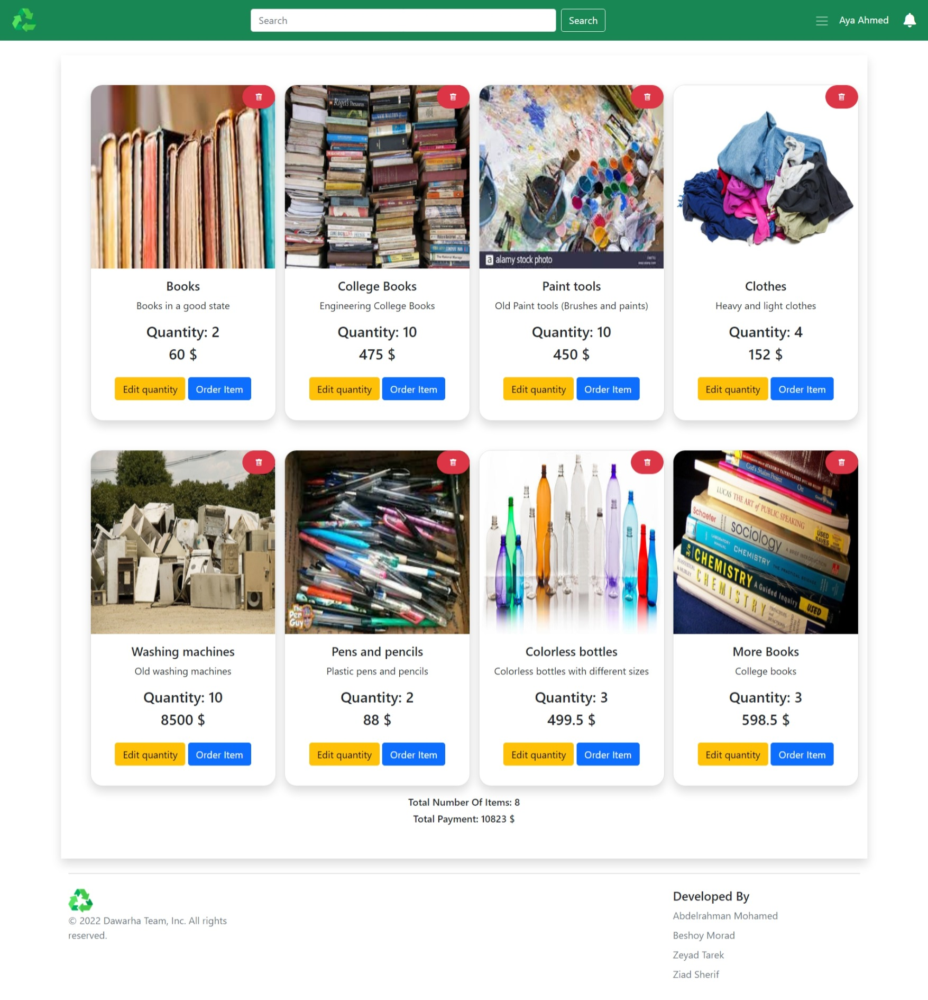</a>
   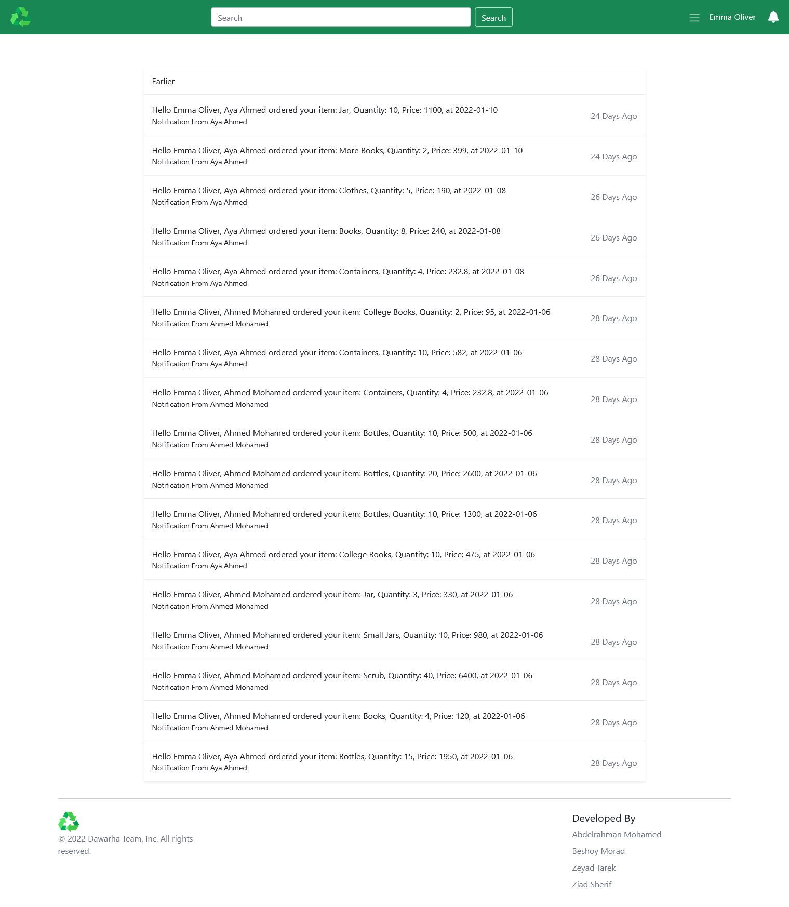</a>
   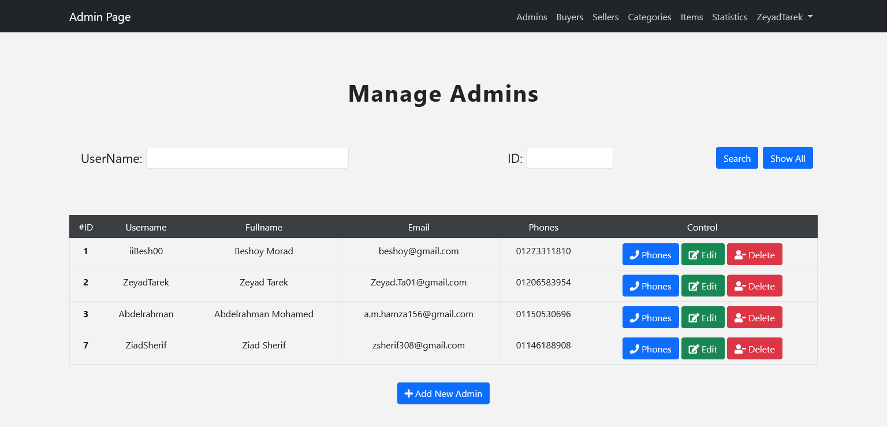</a>
   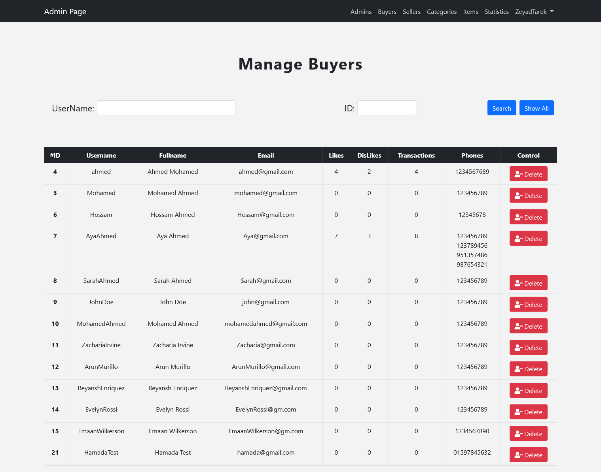</a>
   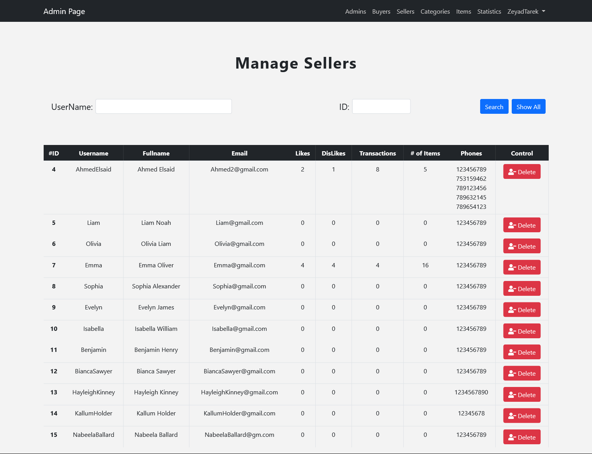</a>
   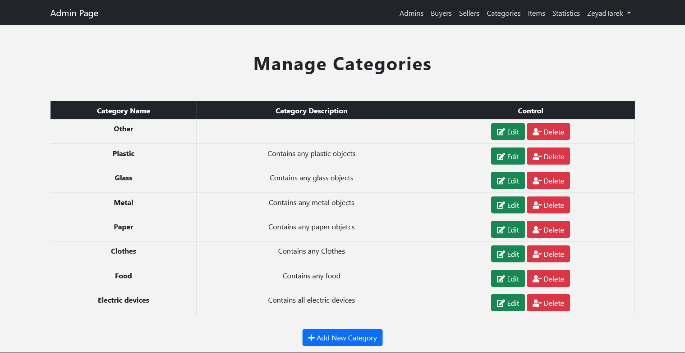</a>
   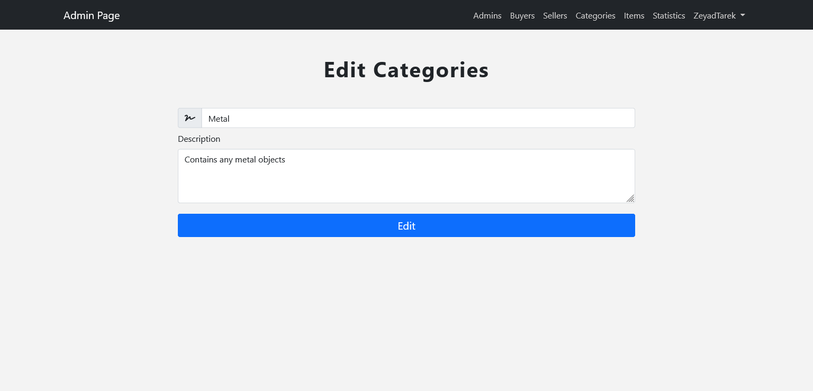</a>
   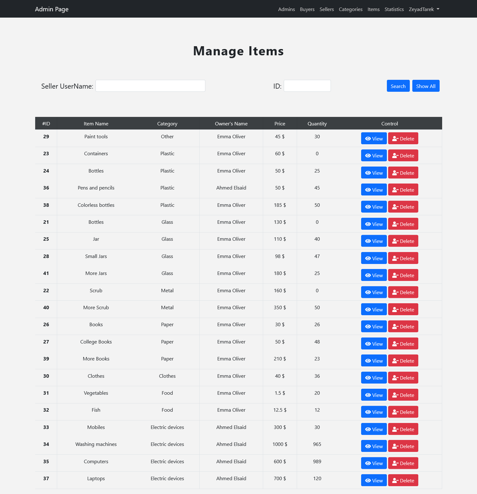</a>
   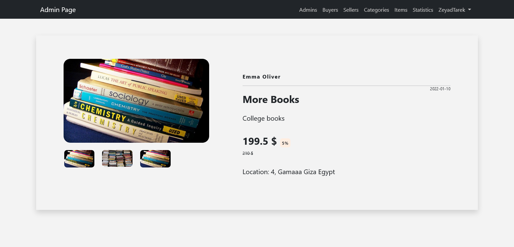</a>
   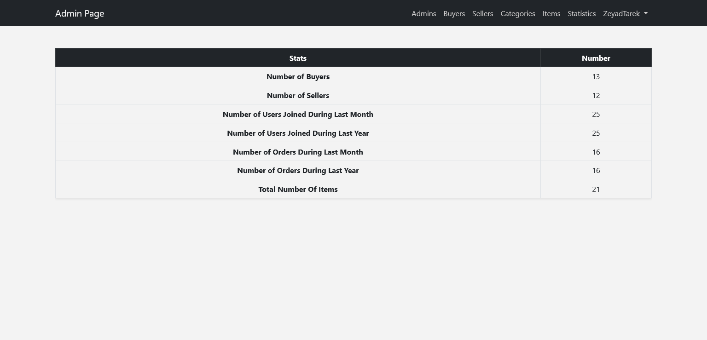</a>
   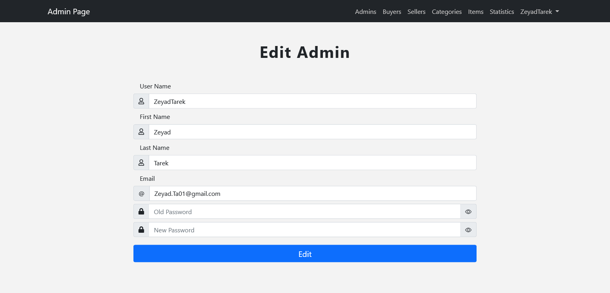</a>
   
   <hr>
   <h2 align='left'>Resopnsive</h2>
   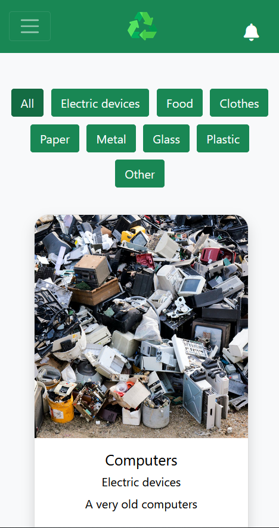</a>
   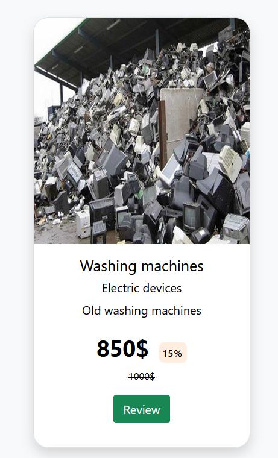</a>
   <hr>
</div>


## 📁 File Structure <a name = "file"></a>

    DawrhaShop
    ├── README.md
    ├── LICENSE
    ├── .gitignore
    ├── index.php
    ├── add_item.php
    ├── cart.php
    ├── editItem.php
    ├── EditProfile.php
    ├── init.php
    ├── logout.php
    ├── notification.php
    ├── orders.php
    ├── profileBuyer.php
    ├── profileSeller.php
    ├── reviewItem.php
    ├── signin.php
    ├── signup.php
    |
    ├── admin
    │   ├── favicon
    |   |
    │   ├── includes
    |   |   ├── functions
    |   |   |   ├── controller.php
    |   |   |   └── functions.php
    |   |   ├── temps
    |   |   |   ├── footer.php
    |   |   |   ├── header.php
    |   |   |   └── navbar.php
    |   |   |
    │   ├── layout
    |   |   ├── css
    |   |   ├── js
    |   |   └── webfonts
    |   |
    │   ├── buyers.php
    │   ├── categories.php
    │   ├── connect.php
    │   ├── index.php
    │   ├── init.php
    │   ├── items.php
    │   ├── logout.php
    │   ├── sellers.php
    │   └── stats.php
    |   |
    ├── data
    │   ├── uploads
    │   |   └── items
    ├── Database File
    ├── favicon
    ├── includes
    |   ├── functions
    |   |   ├── controller.php
    |   |   └── functions.php
    |   ├── temps
    |   |   ├── footer.php
    |   |   ├── header.php
    |   |   └── navbar.php
    ├── layout
    |   ├── images
    |   ├── css
    |   ├── js
    |   └── webfonts
    └── Screenshots

## Contributors <a name = "Contributors"></a>

<table>
  <tr>
    <td align="center">
    <a href="https://github.com/ZeyadTarekk" target="_black">
    
    <br />
    <sub><b>Zeyad Tarek</b></sub></a>
    </td>
    <td align="center">
    <a href="https://github.com/Abd-ELrahmanHamza" target="_black">
    
    <br />
    <sub><b>Abdelrahman Mohamed</b></sub></a>
    </td>
    <td align="center">
    <a href="https://github.com/BeshoyMorad" target="_black">
    
    <br />
    <sub><b>Beshoy Morad</b></sub></a>
    </td>
    <td align="center">
    <a href="https://github.com/ZiadSheriif" target="_black">
    
    <br />
    <sub><b>Ziad Sherif</b></sub></a>
    </td>
    
    
  </tr>
 </table>

## License <a name = "license"></a>

> This software is licensed under MIT License, See [License](https://github.com/ZeyadTarekk/Dawrha-Shop/blob/main/LICENSE) for more information ©ZeyadTarekk.
