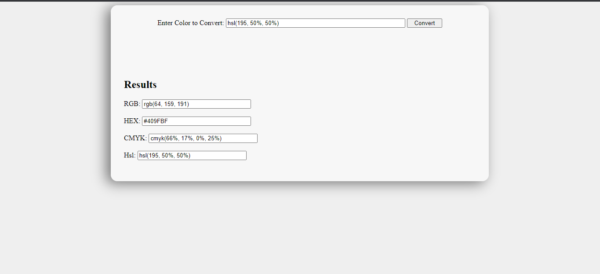

# Color Code Converter

A color code converter that converts between RGB, Hex, CMYK & Hsl.

## Functionalities :-

- Project supports conversions from different formats such as RGB, Hex, CMYK, & Hsl.
- User input is validated using Regex.

## Built with :-

- [x] HTML
- [x] CSS
- [x] JS

## Screenshot

