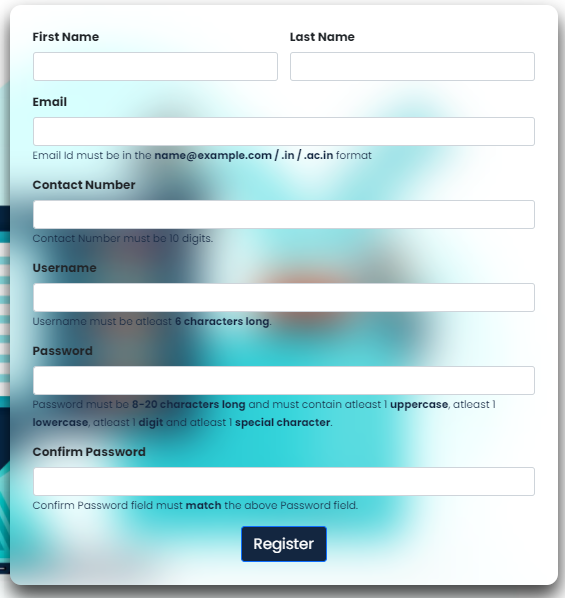

# Form Validation

### About

HTML is the first step towards learning Web Development and HTML forms is one of the important topic. Forms are used every where and this makes Form Validation as one of the important topic a web developer should know.

Forms are used in almost every websites either as login form, registration forms, feedback forms or any other forms. This form validation program performs form fields validation in real time i.e., when the user is entering the details. Most forms validate
after clicking submit button, but validating while user is typing input saves users time and is efficient.

### Tech Stack

* HTML
* CSS
* Bootstrap 5
* JavaScript

### Screenshots

* **Main Page**

* **Form**

  

### Demo Website

[Website](https://kriti242.github.io/Form-Validation/)
