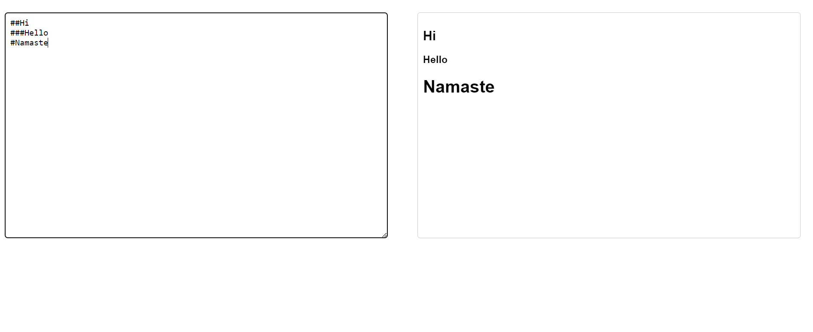

# Markdown Previewer 

Markdown Previewer renders the HTML content based on the markdown code entered by the users. 

Here, you can view my project 

Link - [MarkdownPreviewer](https://markdown-kohl.vercel.app/)

