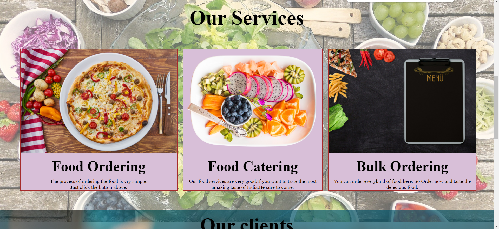

### MyOnlinemeals

This is the website of food delivery which provide many services like catering,ordering and bulk ordering. In this project I have used HTML and CSS for designing the website.

## Setup and run

To setup the project locally follow the instructions:

Install Vs Code by https://code.visualstudio.com/download

Install the extension name Live Server " 

### Fork the github page 

You can fork by https://github.com/Kushal997-das/Project-Guidance

### Clone

After clone it to your git repisoratory

https://github.com/Kushal997-das/Project-Guidance

Open the folder by using Vs Code

After opening the folder follow  these steps:
  ` Project-Guidance`
  ` Web Development`
  ` Basic`
  ` MyOnlineMeals`

  find index.html
  and then if you use Vs Code then choose Go Live in the bottom.

## Landing Page

##Service page

## Contact Page

## Food items Page

