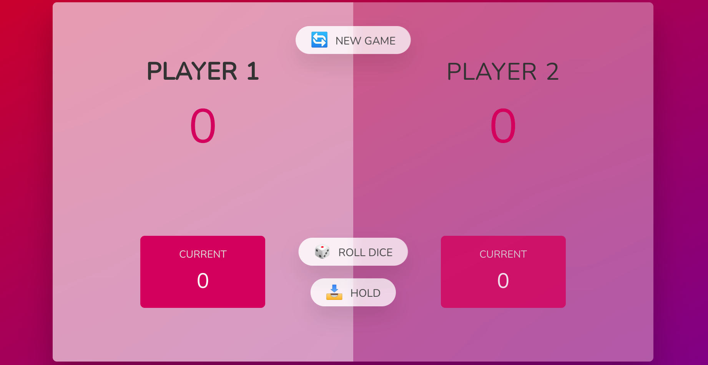
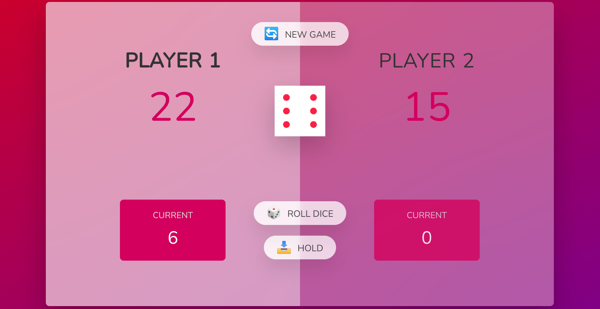
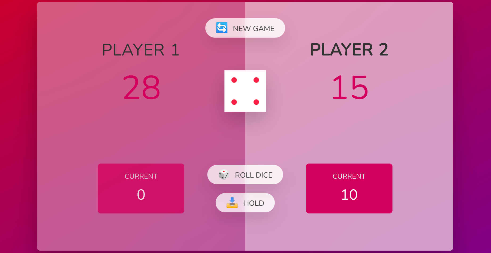
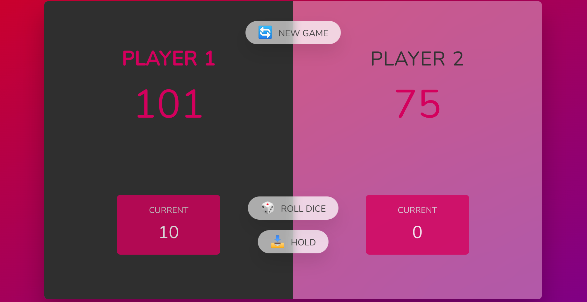

## 📝 Table of Contents

- [About](#about)
- [Technology](#tech)
- [Live Demo](#demo)
- [Screenshots](#Screenshots)
- [Contributors](#Contributors)

## 📙 About 

- The idea of the game is that the first player starts by rolling the dice, if the dice is any number rather than 1 then the number is added to the current score, but if the number is one the turn is switched to the other player and the current score become zero.
- The player can hold the current score at any time to be added to the main score before he gets a number one on the dice and lose his current score.
- The player who reaches to score of 100 first wins the game.

## 💻 Built Using 

- **HTML**
- **CSS**
- **JavaScript**

## Live Demo 

<a href="https://ZeyadTarekk.github.io/Roll-Dice/" >Here</a>

## 📷 Demo Screenshots 

   </a>
   </a>
   </a>
   </a>

   

## Contributors 

<table>
  <tr>
    <td align="center">
    <a href="https://github.com/ZeyadTarekk" target="_black">
    
     
    <b>Zeyad Tarek</b></a>
    </td>
  </tr>
 </table>