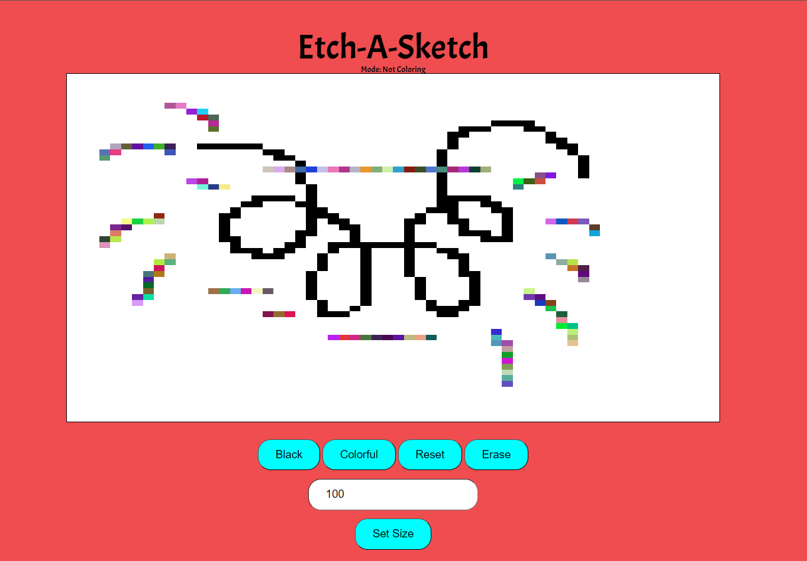

##Project Name: Etch-A-Sketch
###Description: Allows you to your use cursor to draw on the canvas.

###Directions:
Set the canvas size to any size with (maximum 100)
Click on the canvas to start drawing
Click again on the canvas to stop drawing
The status on the top panel will show whether draw mode is active

You can change color of the drawing brush between black and colorful 

Access the live site [here](https://acesif.github.io/Etch-a-sketch/)

