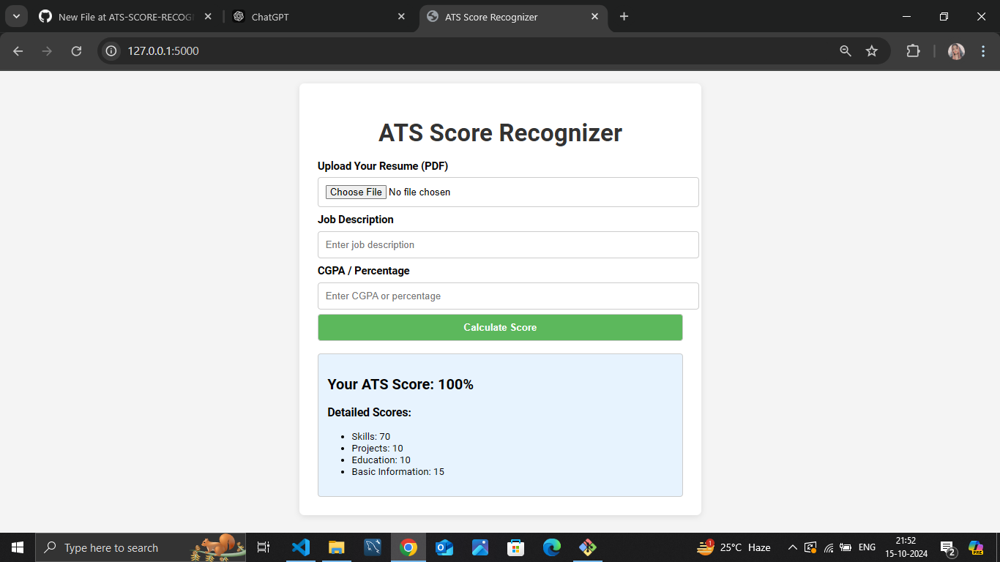

# ATS SCORE RECOGNIZER

## Overview

The ATS Score Recognizer is a tool designed to automatically extract and recognize scores from various documents, such as resumes and job applications. Leveraging advanced optical character recognition (OCR) and machine learning techniques, this project aims to streamline the recruitment process by providing accurate score extraction.

## Features

- **OCR Capabilities**: Utilizes state-of-the-art OCR to read text from images and PDFs.
- **Score Extraction**: Efficiently identifies and extracts relevant scores from documents.
- **User-Friendly Interface**: Easy-to-use interface for uploading documents and viewing results.
- **Multi-Format Support**: Works with multiple document formats including PDF, JPEG, and PNG.

## Installation

To get started with the ATS Score Recognizer, follow these steps:

1. Clone the repository:
   ```bash
   git clone https://github.com/Baigfatema/ATS-SCORE-RECOGNIZER.git
   ````

2. Navigate to the project directory:

```bash
cd ATS-SCORE-RECOGNIZER
```
3. Install the required dependencies:

```bash
pip install -r requirements.txt
```
Usage
Run the application:

```bash
python app.py
```
Upload your document through the provided interface.

View the extracted scores displayed on the screen.

Screenshots
Here are some screenshots of the application in action:



Contact
For any inquiries or issues, please contact:

[Baig-fatema](https://github.com/Baig-fatema)