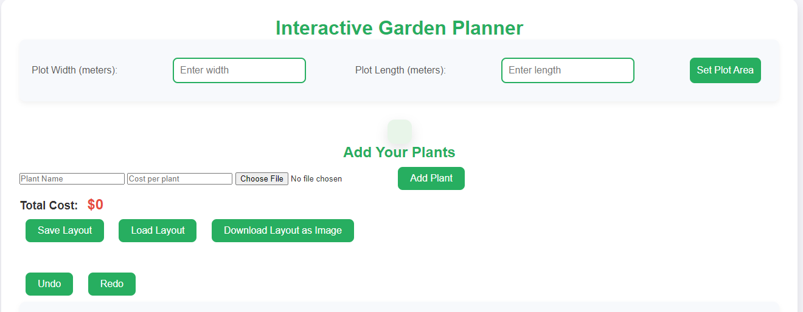

# Interactive Garden Planner

Welcome to the **Interactive Garden Planner**! This web-based application allows you to plan your garden with ease, featuring plot area settings, plant additions, cost calculations, and even an undo/redo feature for modifications.

## Features
- **Custom Plot Settings**: Define the width and length of your garden plot.
- **Add Plants**: Input plant details, including name, cost, and image.
- **Cost Calculation**: The total cost of plants is automatically calculated as you place them in the grid.
- **Drag-and-Drop Planting**: Add plants to the garden grid via drag and drop.
- **Undo/Redo**: Revert or reapply changes to your garden layout.
- **Plant Suggestions**: Get suggestions based on selected weather and soil type.
- **Save and Load Layout**: Save your current garden layout and load it at any time.
- **Download Layout**: Download the layout as an image.

## Demo

Check out the live demo of the **Interactive Garden Planner** by clicking the link below:

[Live Demo](https://gardenplanner-project.netlify.app/)

## How It Works

1. Set the plot dimensions (width and length in meters).
2. Add plants by entering their name, cost, and uploading an image.
3. Drag the plant onto the grid to place it in the desired spot.
4. The total cost of your garden is updated dynamically.
5. Use undo/redo for any changes, and save/load your garden layout for future use.
6. Download the final layout as an image!

## Files

- **HTML**: Basic structure for the planner interface.
- **CSS**: Styles for the garden planner layout.
- **JavaScript**: Handles the grid generation, drag-and-drop functionality, cost calculation, and undo/redo operations.

---

### Instructions to Run Locally
To run the Garden Planner locally, follow these steps:

1. Clone the repository or download the files.
2. Open the `index.html` file in your web browser.
3. Customize and plan your garden!

```bash
git clone https://github.com/your-repository-url
cd your-repository
open index.html
```
---

### Screenshots

