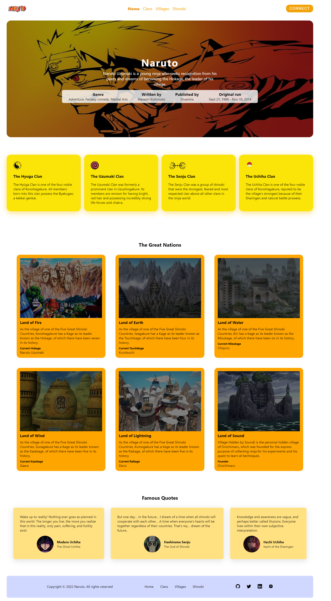

# Naruto

Naruto is a Japanese manga series written and illustrated by Masashi Kishimoto. It tells the story of Naruto Uzumaki, a young ninja who seeks recognition from his peers and dreams of becoming the Hokage, the leader of his village.

As a great fan of anime and Naruto, I have made this project to practice web development using React.

It is a simple website of Naruto which is completely responsive and made using React and styled components that also contain scroll animations implemented using ScrollReveal JavaScript library.

The website contains many sections like the Navbar, Home, Clans, Villages and Shinobi. The motivation behind building the project was to practice making different reusable react components for each section.

The wesite is deployed using Netlify. Click the link below to view the website.

<a href="https://zealous-saha-286121.netlify.app/">Click here to view the Website</a>

### Naruto

  

### Connect With Me

