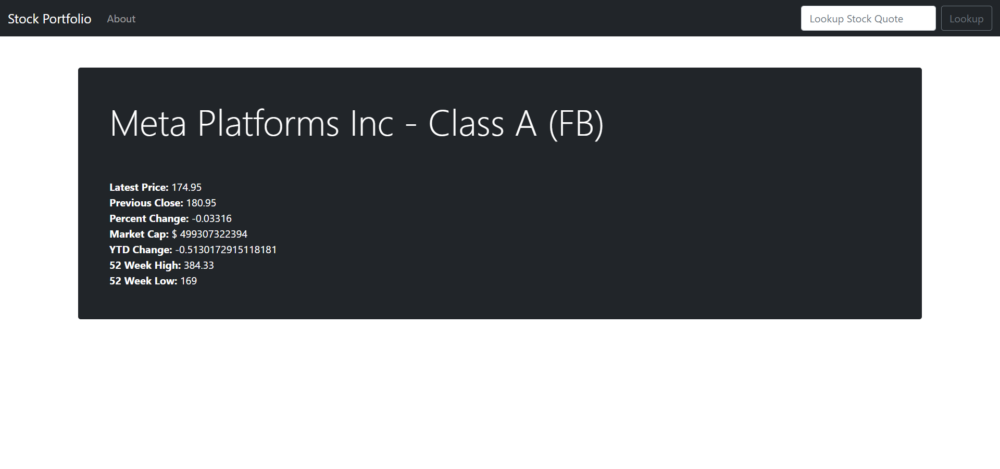
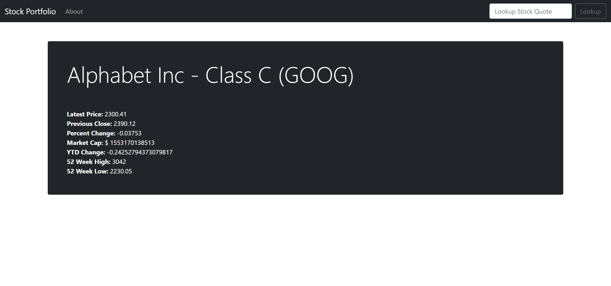
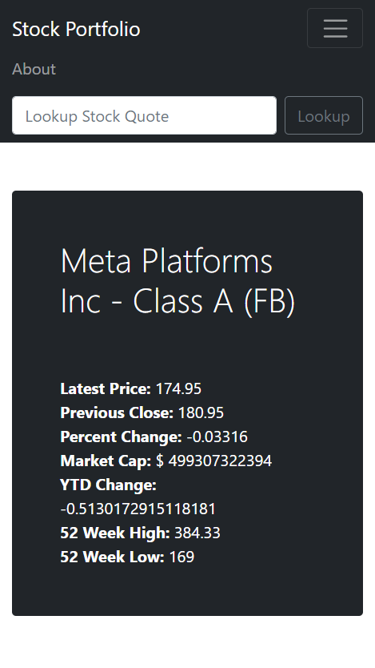

# Stock Market

Stock Market Web App that displays the basic stock information of a particular stock such as price, percent change in the stock value, previous close, 52 weeks high, etc. 
The Web App is made using Node.js and Express.js.
The data is fetched from IEX Cloud Api using the request module and displayed accordingly.
Made use of handlebars to maintain the layout and update the webpage dynamically as the data comes in.

The wesite is deployed using Heroku. Click the link below to view the website.

<a href="https://damp-falls-38311.herokuapp.com/">Click here to view the Website</a>

### Stock Market Web App

  

  

  

### Connect With Me

