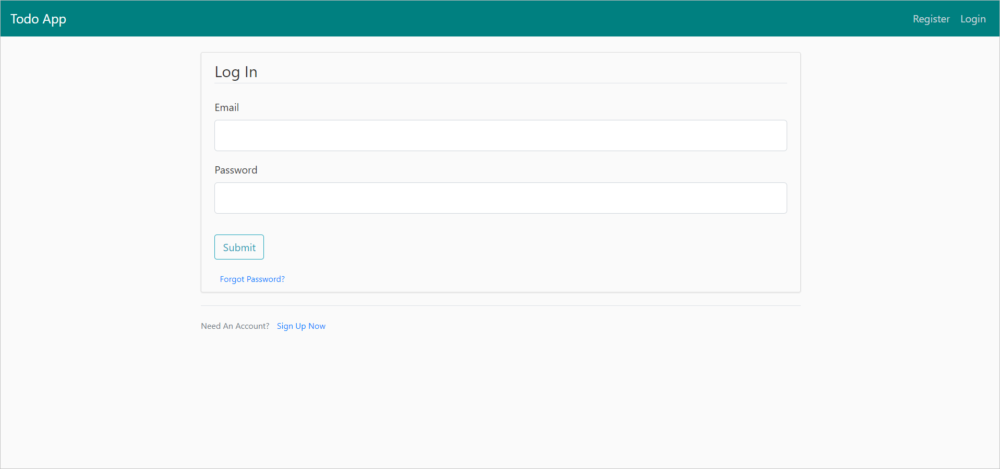

# Todo App using Flask

## Project features:-

### 1. Login

### 2. Sign up

### 3. Home page

### 4. Create New Task (Add Todo)

### 5. Completed Tasks page

### 6. Uncompleted Tasks page

### 7. Updating Completed Task name or status

### 8. Updating UnCompleted Task name or status

### 9. Logout

&copy; [Muhammad Galhoum](https://github.com/muhammadgalhoum "Muhammad Galhoum")
