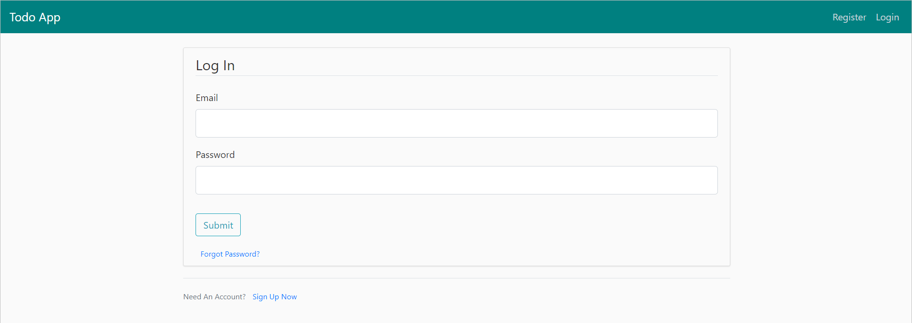

# To-Do List App using Flask


## Installation

Clone the repo link.

```
git clone <repo link>
```

Move to the project folder to create a new virtual environment for the project.
- On Windows :

    ```
    python -m venv env
    ```
- On mac and Linux :

    ```
    python3 -m venv env
    ```
Activate the virtual environment by writing the following command.

- On Windows :

```
.\env\Scripts\activate
```
- On mac and Linux :

    ```
    source env/bin/activate
    ```

Make sure you are in the front of the virtual environment (in the same path of virtual env) then write the following command to install the prerequisites for the project.

```
pip install -r requirements.txt
```
Go to the **app.py** file and run the file, you will notice that there is a file created called **todos_db** which is the database file.

Press on the link which will appear in the  terminal , you notice that the link will open in the browser and you can react with the website as you like.

---

## Project features:-

### 1. Login



### 2. Sign up


### 3. Home page


### 4. Create New Task (Add Todo)


### 5. Completed Tasks page


### 6. Uncompleted Tasks page


### 7. Updating Completed Task name or description or status


### 8. Updating UnCompleted Task name or description or status


### 9. Logout

&copy; [Muhammad Galhoum](https://github.com/muhammadgalhoum "Muhammad Galhoum")
